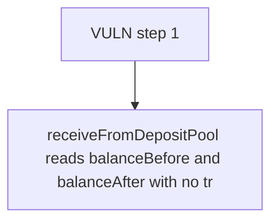

# Elytra: receiveFromDepositPool reads balanceBefore and balanceAfter with no transfer between them 

> **Vulnerability classes:** vuln/locked-funds
>
> **Reproduction:** a faithful minimal reproduction of the vulnerable finding — the vulnerable function is reproduced **verbatim** (marked `@>`) with faithful minimal doubles; local deploy, no fork.

<!-- source-auditvault: https://github.com/Auditware/AuditVault/blob/main/findings/63541-c-01-receivefromdepositpool-does-not-track-assets-transferre.md -->

## Root cause

receiveFromDepositPool reads balanceBefore and balanceAfter with no transfer between them so received is always 0; claimableAssets never increases, every withdrawer's claim pays 0 while 10e18 WHYPE stays permanently locked in the unstaking vault.

```solidity
        uint256 balanceBefore = IERC20(asset).balanceOf(address(this));
        // Assets should be transferred before calling this function
        uint256 balanceAfter = IERC20(asset).balanceOf(address(this));
        uint256 received = balanceAfter - balanceBefore; // @> balanceBefore and balanceAfter are read with NO transfer between them, so received is ALWAYS 0
        claimableAssets[asset] += received;
        emit AssetsReceivedFromDepositPool(asset, received);
```

## Why it's exploitable here

receiveFromDepositPool reads balanceBefore and balanceAfter with no transfer between them so received is always 0; claimableAssets never increases, every withdrawer's claim pays 0 while 10e18 WHYPE stays permanently locked in the unstaking vault.

## Attack path



## Marked-line walkthrough (Playground)

The EVM Playground pins each step to the exact executed source line in `0x671d353a77…`:

1. **L88** — VULN step 1: balanceBefore and balanceAfter are read with NO transfer between them, so received is ALWAYS 0

## PoC

Registry (Foundry, local deploy — verbatim vulnerable source + harm-asserting test + negative control):

```bash
cd 63541-c-01-receivefromdepositpool-does-not-track-assets-transferre_exp
forge test -vvv
```

The browser Playground replays the same synthetic opcode-for-opcode and measures the harm: **receiveFromDepositPool reads balanceBefore and balanceAfter with no transfer between them so received is always 0; claimableAssets never inc**. Both gates are green (registry `forge test` PASS + Playground `_verify-poc` **VERDICT: PASS**).
