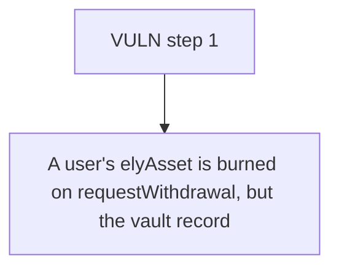

# Elytra: A user's elyAsset is burned on requestWithdrawal

> **Vulnerability classes:** vuln/locked-funds
>
> **Reproduction:** a faithful minimal reproduction of the vulnerable finding — the vulnerable function is reproduced **verbatim** (marked `@>`) with faithful minimal doubles; local deploy, no fork.

<!-- source-auditvault: https://github.com/Auditware/AuditVault/blob/main/findings/63542-c-02-withdrawal-requests-through-deposit-pool-lost-permanent.md -->

## Root cause

A user's elyAsset is burned on requestWithdrawal, but the vault records the deposit pool (msg.sender) as the request owner, so the user's completeWithdrawal() reverts forever and 6e18 underlying HYPE is permanently locked in the vault.

```solidity

        // ─── VERBATIM vulnerable assignment from the finding ───
        withdrawalRequests[requestId] = WithdrawalRequest({
            user: msg.sender, // @> records the CALLER (deposit pool), not the real user -> user can never complete
            asset: asset,
            elyAssetAmount: elyAssetAmount,
```

## Why it's exploitable here

A user's elyAsset is burned on requestWithdrawal, but the vault records the deposit pool (msg.sender) as the request owner, so the user's completeWithdrawal() reverts forever and 6e18 underlying HYPE is permanently locked in the vault.

## Attack path



## Marked-line walkthrough (Playground)

The EVM Playground pins each step to the exact executed source line in `0xbd4fd5a3ce…`:

1. **L163** — VULN step 1: records the CALLER (deposit pool), not the real user -> user can never complete

## PoC

Registry (Foundry, local deploy — verbatim vulnerable source + harm-asserting test + negative control):

```bash
cd 63542-c-02-withdrawal-requests-through-deposit-pool-lost-permanent_exp
forge test -vvv
```

The browser Playground replays the same synthetic opcode-for-opcode and measures the harm: **A user's elyAsset is burned on requestWithdrawal, but the vault records the deposit pool (msg.sender) as the request owner, so the user's co**. Both gates are green (registry `forge test` PASS + Playground `_verify-poc` **VERDICT: PASS**).
