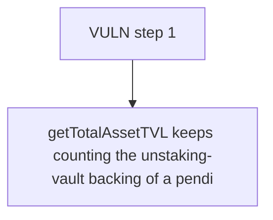

# Elytra: getTotalAssetTVL keeps counting the unstaking-vault backing of a pending withdrawal whose 

> **Vulnerability classes:** vuln/theft · vuln/price
>
> **Reproduction:** a faithful minimal reproduction of the vulnerable finding — the vulnerable function is reproduced **verbatim** (marked `@>`) with faithful minimal doubles; local deploy, no fork.

<!-- source-auditvault: https://github.com/Auditware/AuditVault/blob/main/findings/63543-c-03-tvl-errors-by-including-pending-withdrawal-assets-pasho.md -->

## Root cause

getTotalAssetTVL keeps counting the unstaking-vault backing of a pending withdrawal whose elyHYPE shares were already burned, spiking price from 1.5 to 3.75; the attacker redeems 4e18 elyHYPE for 15e18 HYPE (vs 6e18 fair), draining the 9e18 reserve owed to the pending withdrawer, who is then paid 0.

```solidity
        uint256 strategyAllocated = assetsAllocatedToStrategies[asset];
        uint256 unstakingVaultBalance = _getUnstakingVaultBalance(asset);

        return poolBalance + strategyAllocated + unstakingVaultBalance; // @> counts unstaking-vault backing of already-burned pending shares → inflates TVL/price
    }

```

## Why it's exploitable here

getTotalAssetTVL keeps counting the unstaking-vault backing of a pending withdrawal whose elyHYPE shares were already burned, spiking price from 1.5 to 3.75; the attacker redeems 4e18 elyHYPE for 15e18 HYPE (vs 6e18 fair), draining the 9e18 reserve owed to the pending withdrawer, who is then paid 0.

## Attack path



## Marked-line walkthrough (Playground)

The EVM Playground pins each step to the exact executed source line in `0xe3a787a4e4…`:

1. **L177** — VULN step 1: counts unstaking-vault backing of already-burned pending shares → inflates TVL/price

## PoC

Registry (Foundry, local deploy — verbatim vulnerable source + harm-asserting test + negative control):

```bash
cd 63543-c-03-tvl-errors-by-including-pending-withdrawal-assets-pasho_exp
forge test -vvv
```

The browser Playground replays the same synthetic opcode-for-opcode and measures the harm: **getTotalAssetTVL keeps counting the unstaking-vault backing of a pending withdrawal whose elyHYPE shares were already burned, spiking price **. Both gates are green (registry `forge test` PASS + Playground `_verify-poc` **VERDICT: PASS**).
