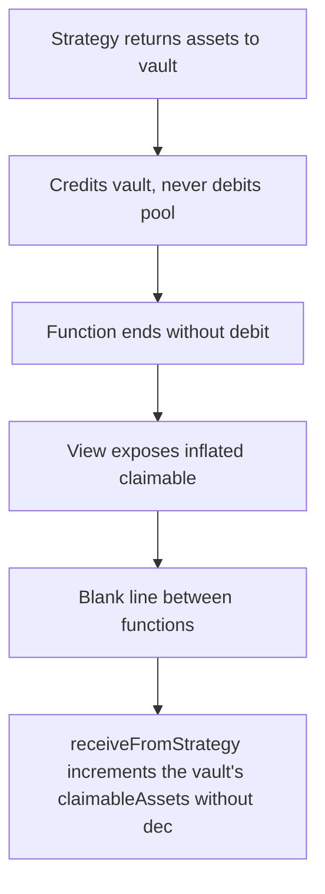

# Elytra: receiveFromStrategy increments the vault's claimableAssets without decrementing the deposi

> **Vulnerability classes:** vuln/unfair-mint · vuln/price
>
> **Reproduction:** a faithful minimal reproduction of the vulnerable finding — the vulnerable function is reproduced **verbatim** (marked `@>`) with faithful minimal doubles; local deploy, no fork.

<!-- source-auditvault: https://github.com/Auditware/AuditVault/blob/main/findings/63544-h-01-tvl-double-counts-assets-returned-from-strategy-to-vaul.md -->

## Root cause

receiveFromStrategy increments the vault's claimableAssets without decrementing the deposit pool's assetsAllocatedToStrategies, so getTotalAssetTVL double-counts the returned assets: it reports 200e18 TVL while the protocol truly holds only 100e18 (a 100e18 phantom over-report that inflates the elyAsset mint/redeem price).

```solidity
    /// @param asset Asset address
    /// @param amount Amount received
    function receiveFromStrategy(address asset, uint256 amount) external onlyStrategy {
        claimableAssets[asset] += amount; // @> increments vault claimable but never decrements ElytraDepositPoolV1.assetsAllocatedToStrategies -> TVL double-count
        emit AssetsReceivedFromStrategy(asset, amount);
    }
```

## Why it's exploitable here

receiveFromStrategy increments the vault's claimableAssets without decrementing the deposit pool's assetsAllocatedToStrategies, so getTotalAssetTVL double-counts the returned assets: it reports 200e18 TVL while the protocol truly holds only 100e18 (a 100e18 phantom over-report that inflates the elyAsset mint/redeem price).

## Attack path



## Marked-line walkthrough (Playground)

The EVM Playground pins each step to the exact executed source line in `0xbd4fd5a3ce…`:

1. **L107** — Strategy returns assets to vault: Entry: `receiveFromStrategy` is called by the strategy to hand returned assets back to the vault.
2. **L108** — Credits vault, never debits pool: Root cause: adds to `claimableAssets` but never decrements the pool's `assetsAllocatedToStrategies`, so TVL counts the assets twice.
3. **L110** — Function ends without debit: The function closes here — notably with no `decreaseStrategyAllocation` call to offset the credit just made.
4. **L113** — View exposes inflated claimable: Setup: `getClaimableAssets` returns the credited total, now overstated by the un-offset returned amount.
5. **L119** — Blank line between functions: Setup: whitespace separating the vault's accounting functions; no logic executes here.
6. **L120** — Blank line, no behavior: Setup: whitespace between functions; no behavior on this line.
7. **L125** — The missing decrement call: Setup: `decreaseStrategyAllocation` is the pool function that should have been called to cancel the double-count.

## PoC

Registry (Foundry, local deploy — verbatim vulnerable source + harm-asserting test + negative control):

```bash
cd 63544-h-01-tvl-double-counts-assets-returned-from-strategy-to-vaul_exp
forge test -vvv
```

The browser Playground replays the same synthetic opcode-for-opcode and measures the harm: **receiveFromStrategy increments the vault's claimableAssets without decrementing the deposit pool's assetsAllocatedToStrategies, so getTotalA**. Both gates are green (registry `forge test` PASS + Playground `_verify-poc` **VERDICT: PASS**).
