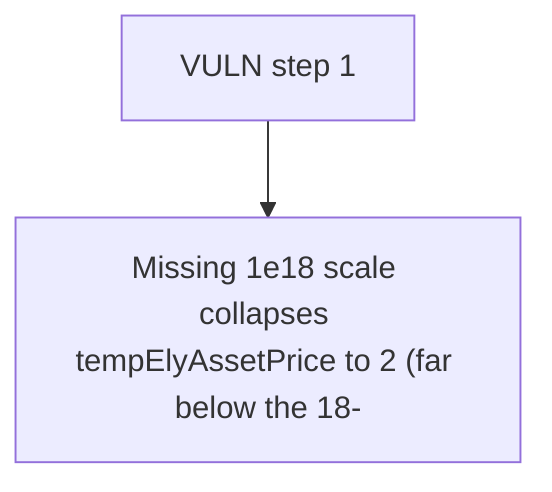

# Elytra: Missing 1e18 scale collapses tempElyAssetPrice to 2 (far below the 18-decimal oldElyAssetP

> **Vulnerability classes:** vuln/locked-funds · vuln/reward-accounting · vuln/price
>
> **Reproduction:** a faithful minimal reproduction of the vulnerable finding — the vulnerable function is reproduced **verbatim** (marked `@>`) with faithful minimal doubles; local deploy, no fork.

<!-- source-auditvault: https://github.com/Auditware/AuditVault/blob/main/findings/63546-h-03-scaling-error-in-elyasset-price-calculation-leads-to-fe.md -->

## Root cause

Missing 1e18 scale collapses tempElyAssetPrice to 2 (far below the 18-decimal oldElyAssetPrice 1e18), so the reward/fee branch never fires and the protocol permanently accrues 0 performance fee instead of the owed 100e18 per update.

```solidity
    function updateElyAssetPrice(uint256 totalValueInProtocol, uint256 elyAssetSupply) external {
        uint256 protocolFeeInHYPE;
        {
            uint256 tempElyAssetPrice = totalValueInProtocol / elyAssetSupply; // @> missing 1e18 scale: 18-dec/18-dec collapses price to a bare integer, always < oldElyAssetPrice
            if (tempElyAssetPrice > oldElyAssetPrice) {
                uint256 increaseInElyAssetPrice = tempElyAssetPrice - oldElyAssetPrice;
```

## Why it's exploitable here

Missing 1e18 scale collapses tempElyAssetPrice to 2 (far below the 18-decimal oldElyAssetPrice 1e18), so the reward/fee branch never fires and the protocol permanently accrues 0 performance fee instead of the owed 100e18 per update.

## Attack path



## Marked-line walkthrough (Playground)

The EVM Playground pins each step to the exact executed source line in `0x671d353a77…`:

1. **L62** — VULN step 1: missing 1e18 scale: 18-dec/18-dec collapses price to a bare integer, always < oldElyAssetPrice

## PoC

Registry (Foundry, local deploy — verbatim vulnerable source + harm-asserting test + negative control):

```bash
cd 63546-h-03-scaling-error-in-elyasset-price-calculation-leads-to-fe_exp
forge test -vvv
```

The browser Playground replays the same synthetic opcode-for-opcode and measures the harm: **Missing 1e18 scale collapses tempElyAssetPrice to 2 (far below the 18-decimal oldElyAssetPrice 1e18), so the reward/fee branch never fires a**. Both gates are green (registry `forge test` PASS + Playground `_verify-poc` **VERDICT: PASS**).
