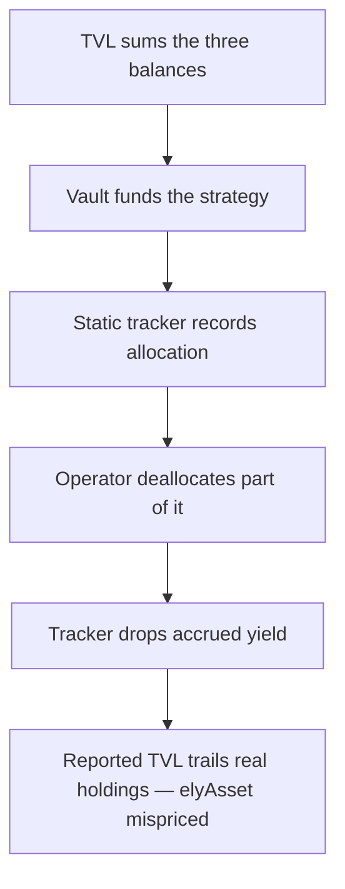

# Elytra: static strategy-allocation tracker mis-reports vault TVL

> **Vulnerability classes:** vuln/accounting · vuln/logic · vuln/frontrun
>
> **Reproduction:** a faithful minimal reproduction of the vulnerable finding — the audited `getTotalAssetTVL` view and the allocation/deallocation tracker updates are reproduced **verbatim** (marked `@>`) with faithful minimal doubles; local deploy, no fork.

<!-- source-auditvault: https://github.com/pashov/audits/blob/master/team/md/Elytra-security-review_2025-07-10.md -->

## Root cause

Elytra tracks how many assets sit inside its restaking strategies with a static storage counter, `assetsAllocatedToStrategies[asset]`, and sums that counter into `getTotalAssetTVL()`. The counter is only bumped on allocate (`+= amount`) and decremented on deallocate by the *tokens actually withdrawn* (`-= withdrawn`) — it is never reconciled against the strategy's real balance, so yield that grows inside the strategy is invisible to it. The vulnerable accounting, reproduced verbatim from the finding:

```solidity
function getTotalAssetTVL(address asset) public view returns (uint256 totalTVL) {
    uint256 poolBalance = IERC20(asset).balanceOf(address(this));
    uint256 strategyAllocated = assetsAllocatedToStrategies[asset];
    uint256 unstakingVaultBalance = _getUnstakingVaultBalance(asset);

    return poolBalance + strategyAllocated + unstakingVaultBalance;
}
```

```solidity
// Called during allocation
assetsAllocatedToStrategies[asset] += amount;

// Called during deallocation
uint256 withdrawn = IElytraStrategy(strategy).withdraw(asset, amount);
if (withdrawn <= assetsAllocatedToStrategies[asset]) {
@>  assetsAllocatedToStrategies[asset] -= withdrawn;
} else {
    assetsAllocatedToStrategies[asset] = 0;
}
```

`strategyAllocated` is a manually-maintained mirror, not a live balance. Once the strategy's real holdings and the counter diverge (yield, realized P&L, or slashing), `getTotalAssetTVL()` reports a number that no longer matches the assets the protocol actually controls — and `elyAsset` is priced off that number.

## Why it's exploitable here

Following the finding's worked example with a 6-decimal asset (USDC):

1. Depositors fund the vault with `100`. The operator allocates all `100` to a strategy → counter `= 100`, strategy holds `100`, pool `= 0`.
2. The strategy accrues `+20` of yield → strategy now holds `120`, but the counter is still `100`.
3. The operator deallocates `60`. `withdraw` returns `60`, so the branch runs `counter -= 60 => 40`; the strategy still holds `120 - 60 = 60` and the pool holds `60`.
4. `getTotalAssetTVL()` = pool `60` + counter `40` + unstaking `0` = **`100`**, but the protocol's real holdings are pool `60` + strategy `60` = **`120`**.

The reported TVL trails real holdings by the full `20` of un-credited yield, so `elyAsset` is deflated. A user who observes the un-accounted yield can mint `elyAsset` at the deflated price, wait for the operator to deallocate (realizing the yield into TVL and spiking the price), then redeem for a risk-free profit that belongs to existing holders. The same static-mirror flaw runs the other way for realized losses and slashing — the counter cannot be reduced without a withdrawal, so TVL and `elyAsset` stay over-inflated, allowing withdrawals of more than the protocol truly owns.

## Attack path



## Marked-line walkthrough (Playground)

The EVM Playground pins each step to the exact executed source line in `0xce01759b…`:

1. **L125** — TVL sums the three balances: getTotalAssetTVL adds the pool balance, the static strategy tracker, and the unstaking balance into the number that prices elyAsset.
2. **L132** — Vault funds the strategy: Setup: during allocation the vault transfers the principal into the restaking strategy, which now holds the real tokens.
3. **L135** — Static tracker records allocation: Setup: assetsAllocatedToStrategies is bumped by the allocated amount, recording 100 as the strategy's tracked holdings.
4. **L140** — Operator deallocates part of it: The operator withdraws part of the position from the strategy, pulling 60 tokens back into the vault's pool balance.
5. **L144** — Tracker drops accrued yield: Root cause: the tracker is decremented only by tokens withdrawn and never reconciled to the strategy's real balance, so in-strategy yield is silently lost.
6. **L150** — Unstaking balance is read: The unstaking-vault component of TVL is queried; with no pending unstakes it contributes nothing to the reported total.
7. **L152** — Unstaking resolves to zero: It returns zero, so reported TVL now rests entirely on the pool balance plus the stale, understated strategy tracker.
8. **L158** — Un-credited yield marks the gap: Reported TVL (100) trails real holdings (120) by the full 20 of un-credited yield, mispricing elyAsset; the gap is marked at the sink.

## PoC

Registry (Foundry, local deploy — verbatim vulnerable source + harm-asserting test):

```bash
cd 63547-h-04-strategy-allocation-tracking-errors-affect-tvl-calculat_exp && forge test -vvv
```

The browser Playground replays the same synthetic opcode-for-opcode and measures the harm: **allocate 100, accrue +20 yield, deallocate 60, and read `getTotalAssetTVL` = 100 against real holdings of 120 — a 20 TVL gap that mis-prices elyAsset**. Both gates are green (registry `forge test` PASS + Playground `_verify-poc` **VERDICT: PASS**).
