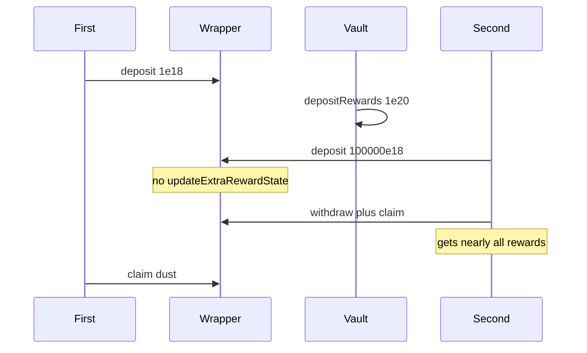

# StakeDAO — [C-01] Missing extra reward per token update on deposit

> **Vulnerability classes:** reward-calculation · reward-theft · reward-accounting

> **Reproduction:** self-contained Foundry PoC, forge-std only.

<!-- non-defihacklabs -->
<!-- source-auditvault: https://github.com/Auditware/AuditVault/blob/main/findings/63598-c-01-missing-update-of-extra-reward-per-token-during-deposit.md -->
<!-- date: 2025-07 -->

**AuditVault taxonomy:** `severity/high` · `sector/staking` · `platform/pashov` · `reward-calculation` · `reward-theft`

---

## Key info

| | |
|---|---|
| **Impact** | **HIGH** — new depositor steals nearly all pending extra rewards |
| **Protocol** | StakeDAO StrategyWrapper |
| **Vulnerable code** | `_deposit` checkpoints `extraRewardPerToken` without `_updateExtraRewardState` |
| **Bug class** | Stale reward index on deposit |
| **Finding** | Pashov · StakeDAO 2025-07-21 · #63598 |

---

## TL;DR

First user deposits and extra rewards are funded. Second user deposits a huge amount without the index updating first, then withdraws/claims — receives ~100k/100001 of rewards that should all go to the first user.

## The vulnerable code

```solidity
// missing: _updateExtraRewardState(rewardTokens);
checkpoint.rewardPerTokenPaid[t] = extraRewardPerToken[t]; // @> VULN stale
```

## Diagrams



## Impact

Existing depositors lose fair share of extra rewards to flash depositors.

## Sources

- [AuditVault #63598](https://github.com/Auditware/AuditVault/blob/main/findings/63598-c-01-missing-update-of-extra-reward-per-token-during-deposit.md)
- [Pashov StakeDAO 2025-07-21](https://github.com/pashov/audits/blob/master/team/md/StakeDAO-security-review_2025-07-21.md)
