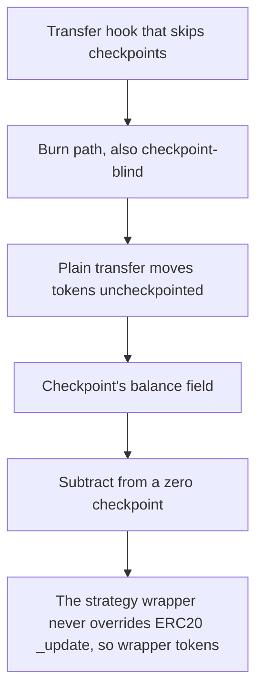

# StakeDAO: The strategy wrapper never overrides ERC20 _update

> **Vulnerability classes:** vuln/locked-funds
>
> **Reproduction:** a faithful minimal reproduction of the vulnerable finding — the vulnerable function is reproduced **verbatim** (marked `@>`) with faithful minimal doubles; local deploy, no fork.

<!-- source-auditvault: https://github.com/Auditware/AuditVault/blob/main/findings/63599-c-02-checkpoints-are-almost-always-outdated-due-to-missing.md -->

## Root cause

The strategy wrapper never overrides ERC20 _update, so wrapper tokens moved by a plain transfer (standing in for a Morpho Blue collateral seizure) carry no checkpoint for the recipient; Bob's redeem then runs checkpoint.balance -= amount against a zero checkpoint, underflows and reverts permanently, locking 1000e18 wrapper tokens plus their underlying in the wrapper.

```solidity
    /// @notice Redeem wrapper tokens for underlying, decrementing the checkpoint.
    function redeem(uint256 amount) external {
        UserCheckpoint storage checkpoint = userCheckpoints[msg.sender];
        checkpoint.balance -= amount; // @> revert here due to underflow
        _burn(msg.sender, amount);
        underlying.transfer(msg.sender, amount);
```

## Why it's exploitable here

The strategy wrapper never overrides ERC20 _update, so wrapper tokens moved by a plain transfer (standing in for a Morpho Blue collateral seizure) carry no checkpoint for the recipient; Bob's redeem then runs checkpoint.balance -= amount against a zero checkpoint, underflows and reverts permanently, locking 1000e18 wrapper tokens plus their underlying in the wrapper.

## Attack path



## Marked-line walkthrough (Playground)

The EVM Playground pins each step to the exact executed source line in `0x671d353a77…`:

1. **L93** — Transfer hook that skips checkpoints: The ERC20 `_update` hook fires on every transfer but is never overridden to checkpoint the recipient, leaving `userCheckpoints` stale — the core gap.
2. **L110** — Burn path, also checkpoint-blind: Setup: internal `_burn` reduces a holder's balance without touching their checkpoint, part of the same missing bookkeeping.
3. **L119** — Plain transfer moves tokens uncheckpointed: A standard `transferFrom` (standing in for a Morpho Blue collateral seizure) hands wrapper tokens to a recipient who gets no checkpoint entry.
4. **L138** — Checkpoint's balance field: The `balance` field inside each `UserCheckpoint`; for a transfer recipient it stays zero because no transfer path ever sets it.
5. **L160** — Subtract from a zero checkpoint: Root cause: redeem does `checkpoint.balance -= amount` against a recipient whose checkpoint was never written, underflowing and reverting forever.
6. **L162** — Payout that never executes: The underlying would be returned here, but the line-160 underflow reverts first, so the 1000e18 tokens and their underlying stay locked.
7. **L182** — The per-user checkpoint mapping: Setup: `userCheckpoints` maps each address to its checkpoint; recipients of raw transfers never get an entry, which is what breaks redeem.

## PoC

Registry (Foundry, local deploy — verbatim vulnerable source + harm-asserting test + negative control):

```bash
cd 63599-c-02-checkpoints-are-almost-always-outdated-due-to-missing_exp
forge test -vvv
```

The browser Playground replays the same synthetic opcode-for-opcode and measures the harm: **The strategy wrapper never overrides ERC20 _update, so wrapper tokens moved by a plain transfer (standing in for a Morpho Blue collateral se**. Both gates are green (registry `forge test` PASS + Playground `_verify-poc` **VERDICT: PASS**).
