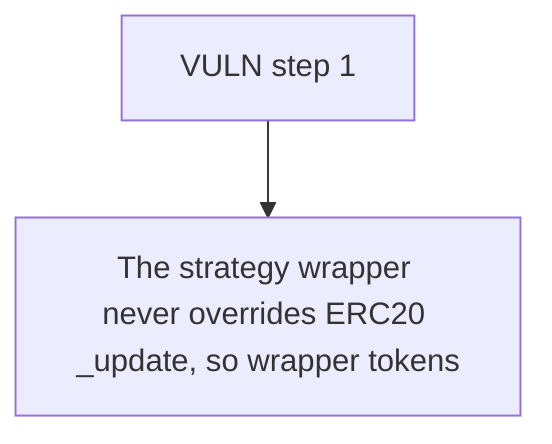

# StakeDAO: The strategy wrapper never overrides ERC20 _update

> **Vulnerability classes:** vuln/locked-funds
>
> **Reproduction:** a faithful minimal reproduction of the vulnerable finding — the vulnerable function is reproduced **verbatim** (marked `@>`) with faithful minimal doubles; local deploy, no fork.

<!-- source-auditvault: https://github.com/Auditware/AuditVault/blob/main/findings/63599-c-02-checkpoints-are-almost-always-outdated-due-to-missing.md -->

## Root cause

The strategy wrapper never overrides ERC20 _update, so wrapper tokens moved by a plain transfer (standing in for a Morpho Blue collateral seizure) carry no checkpoint for the recipient; Bob's redeem then runs checkpoint.balance -= amount against a zero checkpoint, underflows and reverts permanently, locking 1000e18 wrapper tokens plus their underlying in the wrapper.

```solidity
    /// @notice Redeem wrapper tokens for underlying, decrementing the checkpoint.
    function redeem(uint256 amount) external {
        UserCheckpoint storage checkpoint = userCheckpoints[msg.sender];
        checkpoint.balance -= amount; // @> revert here due to underflow
        _burn(msg.sender, amount);
        underlying.transfer(msg.sender, amount);
```

## Why it's exploitable here

The strategy wrapper never overrides ERC20 _update, so wrapper tokens moved by a plain transfer (standing in for a Morpho Blue collateral seizure) carry no checkpoint for the recipient; Bob's redeem then runs checkpoint.balance -= amount against a zero checkpoint, underflows and reverts permanently, locking 1000e18 wrapper tokens plus their underlying in the wrapper.

## Attack path



## Marked-line walkthrough (Playground)

The EVM Playground pins each step to the exact executed source line in `0x671d353a77…`:

1. **L160** — VULN step 1: revert here due to underflow

## PoC

Registry (Foundry, local deploy — verbatim vulnerable source + harm-asserting test + negative control):

```bash
cd 63599-c-02-checkpoints-are-almost-always-outdated-due-to-missing_exp
forge test -vvv
```

The browser Playground replays the same synthetic opcode-for-opcode and measures the harm: **The strategy wrapper never overrides ERC20 _update, so wrapper tokens moved by a plain transfer (standing in for a Morpho Blue collateral se**. Both gates are green (registry `forge test` PASS + Playground `_verify-poc` **VERDICT: PASS**).
