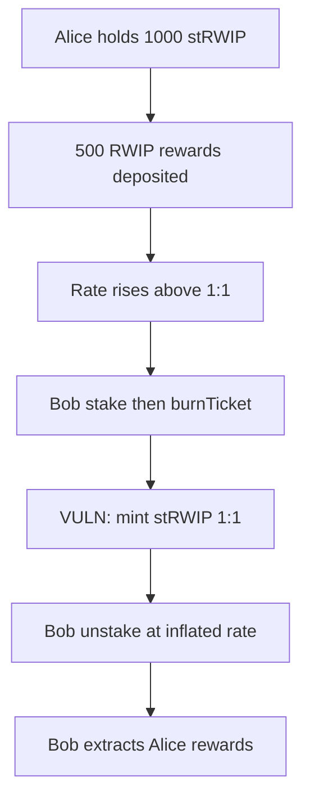

# Aria — stRWIP is always minted for RWIP in a 1:1 ratio

> **Vulnerability classes:** vuln/logic/reward-calculation · reward-theft · reward-accounting

> **Reproduction:** a self-contained Foundry PoC that compiles & runs in an
> isolated project with **only `forge-std`** — no fork, no RPC, no `anvil_state`.
> Full trace: [output.txt](output.txt). PoC:
> [test/63676-h-01-strwip-is-always-minted-for-rwip-in-a-11-ratio-pashov-a_exp.sol](test/63676-h-01-strwip-is-always-minted-for-rwip-in-a-11-ratio-pashov-a_exp.sol).

<!-- non-defihacklabs -->
<!-- source-auditvault: https://github.com/Auditware/AuditVault/blob/main/findings/63676-h-01-strwip-is-always-minted-for-rwip-in-a-11-ratio-pashov-a.md -->
<!-- date: 2025-05 -->

**AuditVault taxonomy:** `severity/high` · `sector/staking` · `sector/vault` · `platform/pashov` · `reward-calculation` · `reward-theft` · `reward-accounting` · `timestamp-dependence`

---

## Key info

| | |
|---|---|
| **Impact** | **HIGH** — attacker steals staking rewards belonging to honest stakers |
| **Protocol** | Aria (RWIP / stRWIP staking) |
| **Vulnerable code** | `RWIPStaking.burnTicket` — mints stRWIP 1:1 with ticket RWIP |
| **Bug class** | Fixed-ratio share mint vs variable-rate redeem |
| **Finding** | Pashov Aria security review 2025-05-12 · #63676 |
| **Report** | [Pashov Aria review](https://github.com/pashov/audits/blob/master/team/md/Aria-security-review_2025-05-12.md) |
| **Source** | [AuditVault](https://github.com/Auditware/AuditVault/blob/main/findings/63676-h-01-strwip-is-always-minted-for-rwip-in-a-11-ratio-pashov-a.md) |
| **Status** | Audit finding — fixed in [PR 51](https://github.com/AriaProtocol/main-contracts/pull/51). Reproduced as a reduced local synthetic. |
| **Compiler** | `^0.8.24` (PoC) |

---

## TL;DR

1. `burnTicket` always mints stRWIP equal to the ticket's RWIP amount (1:1).
2. `unstake` redeems stRWIP at the live exchange rate `balance / supply`.
3. After rewards inflate the rate, stake → burnTicket → unstake yields more RWIP than deposited.
4. An attacker loops this while honest stakers hold shares and drains their rewards.

---

## The vulnerable code

```solidity
function burnTicket(uint256 id) external {
    Ticket storage t = tickets[id];
    require(t.owner == msg.sender, "owner");
    require(!t.burned, "burned");
    t.burned = true;
    stRWIP.mintShares(msg.sender, t.amount); // @> VULN: 1:1 mint instead of exchange rate
    // FIX: mint shares = amount * supply / assets (with virtual shares offset)
}
```

---

## Root cause

Share issuance ignores the current pool exchange rate. Redemption uses the rate, so newly issued shares capture a free slice of prior rewards.

## Preconditions

- At least one honest staker has burned tickets and holds stRWIP.
- Rewards (or donations) of RWIP sit in the staking contract.
- Attacker can stake, burn tickets, and unstake (hold period set to 0 / elapsed in the real protocol).

## Attack walkthrough

1. Alice stakes 1000 RWIP and burns her ticket → 1000 stRWIP.
2. 500 RWIP rewards are deposited → rate &gt; 1.
3. Bob stakes his balance, burns at 1:1, unstakes at the inflated rate.
4. Repeat; Bob extracts most of the 500 rewards; Alice is left with dust.

## Diagrams



---

## Impact

Honest stakers lose essentially all deposited rewards. RWIP staking becomes economically broken for long-term depositors.

## Sources

- [AuditVault finding #63676](https://github.com/Auditware/AuditVault/blob/main/findings/63676-h-01-strwip-is-always-minted-for-rwip-in-a-11-ratio-pashov-a.md)
- [Pashov Aria security review 2025-05-12](https://github.com/pashov/audits/blob/master/team/md/Aria-security-review_2025-05-12.md)
- [AriaProtocol/main-contracts PR 51](https://github.com/AriaProtocol/main-contracts/pull/51)
