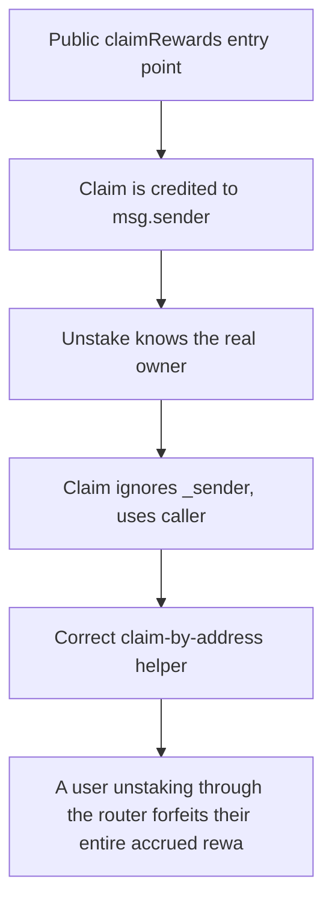

# HYBUX: A user unstaking through the router forfeits their entire accrued reward (1000 HYBUX): _un

> **Vulnerability classes:** vuln/locked-funds · vuln/reward-accounting
>
> **Reproduction:** a faithful minimal reproduction of the vulnerable finding — the vulnerable function is reproduced **verbatim** (marked `@>`) with faithful minimal doubles; local deploy, no fork.

<!-- source-auditvault: https://github.com/Auditware/AuditVault/blob/main/findings/63683-c-01-incorrect-reward-calculation-pashov-audit-group-none-hy.md -->

## Root cause

A user unstaking through the router forfeits their entire accrued reward (1000 HYBUX): _unstakeNFTs claims for msg.sender (the router, which holds no position) then wipes the user's accrual, so the reward is never paid and becomes permanently unrecoverable.

```solidity
    }

    function _unstakeNFTs(address _sender, uint256[] calldata _tokenIds) internal {
        claimRewards(); // @> pays _claimRewards(msg.sender)=router, not the delegated _sender; user's accrued reward is then wiped below
        // clear the user's position and reward checkpoint, and return the NFTs
        rewards[_sender] = 0;
```

## Why it's exploitable here

A user unstaking through the router forfeits their entire accrued reward (1000 HYBUX): _unstakeNFTs claims for msg.sender (the router, which holds no position) then wipes the user's accrual, so the reward is never paid and becomes permanently unrecoverable.

## Attack path



## Marked-line walkthrough (Playground)

The EVM Playground pins each step to the exact executed source line in `0xce01759b82…`:

1. **L113** — Public claimRewards entry point: Setup: `claimRewards()` is the public claim function, but it always credits `msg.sender`, ignoring who actually owns the staked position.
2. **L114** — Claim is credited to msg.sender: `_claimRewards(msg.sender)` pays the immediate caller — fine for a direct user, but wrong when a router forwards the call for someone else.
3. **L117** — Unstake knows the real owner: `_unstakeNFTs` receives `_sender`, the true position owner, and should settle rewards to that address before removing the stake.
4. **L118** — Claim ignores _sender, uses caller: Root cause: `claimRewards()` credits `msg.sender` (the router, no position) instead of `_claimRewards(_sender)`, so the user's reward is never paid.
5. **L128** — Correct claim-by-address helper: `_claimRewards(address)` is the version that pays a named owner — the one unstake should have called, passing `_sender`.
6. **L140** — Staking contract definition: Setup: the `NFTStakingFixed` staking contract that holds positions and accrues per-user rewards.
7. **L154** — Wire up the router address: Setup: stores the router address; the router forwards user unstakes, which is exactly how `msg.sender` diverges from the real owner.

## PoC

Registry (Foundry, local deploy — verbatim vulnerable source + harm-asserting test + negative control):

```bash
cd 63683-c-01-incorrect-reward-calculation-pashov-audit-group-none-hy_exp
forge test -vvv
```

The browser Playground replays the same synthetic opcode-for-opcode and measures the harm: **A user unstaking through the router forfeits their entire accrued reward (1000 HYBUX): _unstakeNFTs claims for msg.sender (the router, which**. Both gates are green (registry `forge test` PASS + Playground `_verify-poc` **VERDICT: PASS**).
