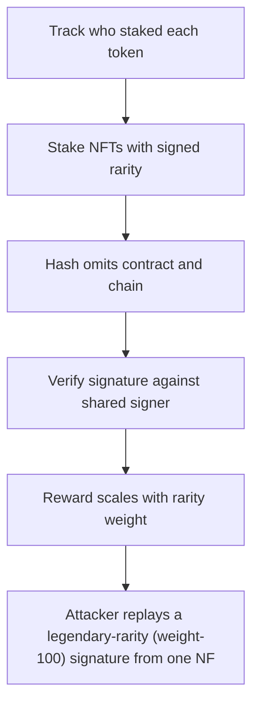

# HYBUX: Attacker replays a legendary-rarity (weight-100) signature from one NFTStaking deployment 

> **Vulnerability classes:** vuln/reward-accounting
>
> **Reproduction:** a faithful minimal reproduction of the vulnerable finding — the vulnerable function is reproduced **verbatim** (marked `@>`) with faithful minimal doubles; local deploy, no fork.

<!-- source-auditvault: https://github.com/Auditware/AuditVault/blob/main/findings/63684-h-01-cross-contract-signature-replay-allows-users-to-inflate.md -->

## Root cause

Attacker replays a legendary-rarity (weight-100) signature from one NFTStaking deployment onto a second deployment sharing the signer, crediting a common (weight-1) NFT with legendary weight and claiming 100,000 REWARD-HYBUX — 100x the 1,000-token weight-1 baseline (a 99,000-token / 99x over-payment).

```solidity
        uint256[] memory _rarityWeightIndexes,
        bytes memory _signature
    ) internal {
        bytes32 hash = keccak256(abi.encode(_sender, _tokenIds, _rarityWeightIndexes)); // @> signature hash omits address(this): an authorization signed for one NFTStaking deployment is replayable on another sharing the signer
        bytes32 digest = keccak256(abi.encodePacked("\x19Ethereum Signed Message:\n32", hash));
        require(_recover(digest, _signature) == signer, "invalid signature");
```

## Why it's exploitable here

Attacker replays a legendary-rarity (weight-100) signature from one NFTStaking deployment onto a second deployment sharing the signer, crediting a common (weight-1) NFT with legendary weight and claiming 100,000 REWARD-HYBUX — 100x the 1,000-token weight-1 baseline (a 99,000-token / 99x over-payment).

## Attack path



## Marked-line walkthrough (Playground)

The EVM Playground pins each step to the exact executed source line in `0xbd4fd5a3ce…`:

1. **L109** — Track who staked each token: Setup: `stakerOf` records the owner of each staked tokenId, later used to attribute and pay rewards by rarity weight.
2. **L124** — Stake NFTs with signed rarity: `_stakeNFTs` takes the caller, token IDs, rarity weights and a `_signature` meant to authorize those weights.
3. **L133** — Hash omits contract and chain: Root cause: signed hash covers only sender, token IDs and rarity weights — no `address(this)` or chainId, so a signature from a sibling deployment replays here.
4. **L135** — Verify signature against shared signer: Checks the signature recovers to `signer`; because two deployments share that signer, a legendary-weight signature passes on both.
5. **L144** — Reward scales with rarity weight: `pendingRewards` computes payout from the token's stored rarity weight — inflate the weight and the payout inflates with it.
6. **L151** — Require the token is staked: Guards that the tokenId is actually staked before paying — passes for the attacker's cheaply-staked common NFT.
7. **L182** — 1000 tokens per weight unit: Setup: each weight unit pays 1000 REWARD-HYBUX, so a replayed weight-100 legendary yields 100,000 vs 1,000 for a real weight-1 common.

## PoC

Registry (Foundry, local deploy — verbatim vulnerable source + harm-asserting test + negative control):

```bash
cd 63684-h-01-cross-contract-signature-replay-allows-users-to-inflate_exp
forge test -vvv
```

The browser Playground replays the same synthetic opcode-for-opcode and measures the harm: **Attacker replays a legendary-rarity (weight-100) signature from one NFTStaking deployment onto a second deployment sharing the signer, credi**. Both gates are green (registry `forge test` PASS + Playground `_verify-poc` **VERDICT: PASS**).
