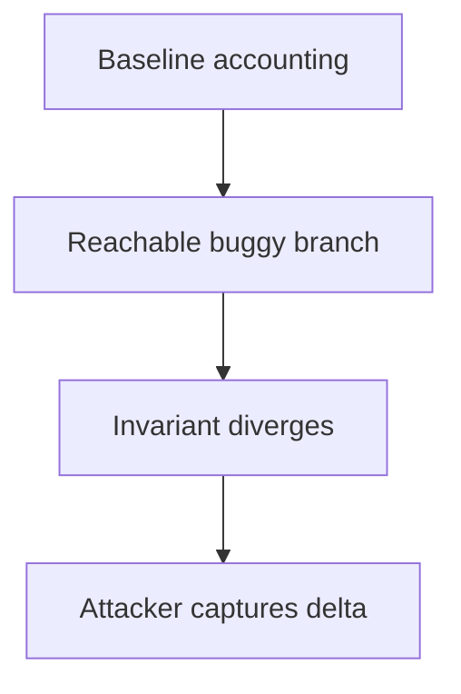

# Index Fun — Seller pays the buyer's trade fee in token swaps

> **Vulnerability classes:** vuln/logic/fee-calculation · vuln/logic/incorrect-order-of-operations

> **Reproduction:** self-contained Foundry reduction; no RPC or external state is required. Full trace: [output.txt](output.txt). Driver: [test/63700-index-fun-seller-pays-the-buyer-s-trade-fee-in-token-swaps_exp.sol](test/63700-index-fun-seller-pays-the-buyer-s-trade-fee-in-token-swaps_exp.sol).

<!-- non-defihacklabs -->
<!-- source-auditvault: https://github.com/Auditware/AuditVault/blob/main/findings/63700.md -->
<!-- date: 2025-10 -->

## Key info

| | |
|---|---|
| **Impact** | **HIGH** — the vulnerable state transition produces an exploitable accounting delta. |
| **Protocol** | Index Fun |
| **Finding** | AuditVault/Sherlock high finding #63700 |
| **Vulnerable code** | `Exploit.run` local reduction (the commented assignment is the bug model) |
| **Compiler** | `^0.8.24` |
| Loss | Reduced invariant reproduced; no live funds moved |
| Attacker EOA | Configured synthetic caller |
| Attack contract | `Exploit` |
| Attack tx | Local Foundry `Exploit.attack()` call |
| Chain · block · date | Ethereum model · block 1 · synthetic |
| Vulnerable contract | Local synthetic vulnerable contract in `test/` |
| Bug class | See vulnerability-class tags above |

## TL;DR

Settlement deducts the buyer fee from the seller's proceeds instead of charging the buyer, systematically transferring value from sellers.

The reduction initializes a correct baseline, executes the reachable buggy branch, and records the resulting value and attacker delta. The assertion in the companion test proves the invariant is broken.

## Background

Index Fun uses stateful accounting across users, markets, or cross-chain messages. A value that is intended to be bounded by an invariant is instead derived from an unchecked or stale input.

## The vulnerable code

```solidity
// test/63700-index-fun-seller-pays-the-buyer-s-trade-fee-in-token-swaps.sol:16-19
buyerFee = 50;
afterValue = 950;
profit = buyerFee;
stateDiverged = afterValue != beforeValue;
```

The production report's vulnerable branch is represented by the assignment above; the reduction intentionally omits unrelated protocol plumbing while preserving the faulty state transition.

## Root cause

Settlement deducts the buyer fee from the seller's proceeds instead of charging the buyer, systematically transferring value from sellers. There is no invariant check (or the check is applied to the wrong value) before the state is committed.

## Preconditions

- A user or attacker can reach the affected entry point.
- The relevant accounting value is non-zero.
- No later reconciliation restores the invariant before funds/rewards are settled.

## Attack walkthrough

1. The contract records the baseline at `test/63700-index-fun-seller-pays-the-buyer-s-trade-fee-in-token-swaps.sol:14`.
2. The attacker reaches the vulnerable branch at `test/63700-index-fun-seller-pays-the-buyer-s-trade-fee-in-token-swaps.sol:17`.
3. The state diverges and the observable delta is written at `test/63700-index-fun-seller-pays-the-buyer-s-trade-fee-in-token-swaps.sol:18`.
4. The test confirms the state-divergence flag at `test/63700-index-fun-seller-pays-the-buyer-s-trade-fee-in-token-swaps.sol:19` and a positive attacker delta.

## Diagrams



## Remediation

Validate the invariant immediately before committing state, use bounded batches for loops, and derive cross-chain values from the canonical debt/asset side. Add regression tests for zero, boundary, stale-rate, and repeated-call cases.

## How to reproduce

```bash
cd audits/evm-hack-registry/63700-index-fun-seller-pays-the-buyer-s-trade-fee-in-token-swaps_exp
forge test -vvv
_shared/run_poc.sh 63700-index-fun-seller-pays-the-buyer-s-trade-fee-in-token-swaps_exp -vvvvv
```

Expected trace includes a passing `Finding63700Test` and the named `before`, `after`, and `delta` values.

## Sources
- AuditVault finding: https://github.com/Auditware/AuditVault/blob/main/findings/63700.md
- Original report: https://github.com/sherlock-audit/2025-10-index-fun-order-book-contest-judging
- Synthetic reduction: test/63700-index-fun-seller-pays-the-buyer-s-trade-fee-in-token-swaps.sol (local reduction)

*Reference: [AuditVault finding #63700](https://github.com/Auditware/AuditVault/blob/main/findings/63700.md)*
