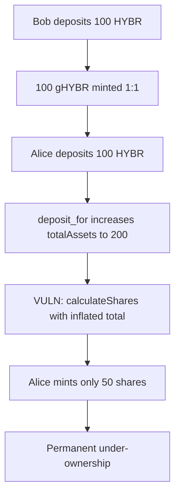

# Hybra Finance — Assets deposited before calculating shares to mint

> **Vulnerability classes:** vuln/logic/wrong-order · first-deposit · indirect-loss

> **Reproduction:** a self-contained Foundry PoC that compiles & runs in an
> isolated project with **only `forge-std`** — no fork, no RPC, no `anvil_state`.
> Full trace: [output.txt](output.txt). PoC:
> [test/63707-h-01-assets-deposited-before-calculating-shares-amount-to-mi_exp.sol](test/63707-h-01-assets-deposited-before-calculating-shares-amount-to-mi_exp.sol).

<!-- non-defihacklabs -->
<!-- source-auditvault: https://github.com/Auditware/AuditVault/blob/main/findings/63707-h-01-assets-deposited-before-calculating-shares-amount-to-mi.md -->
<!-- date: 2025-10 -->

**AuditVault taxonomy:** `severity/high` · `sector/governance` · `platform/code4rena` · `wrong-order` · `first-deposit` · `fot-slippage` · `indirect-loss`

---

## Key info

| | |
|---|---|
| **Impact** | **HIGH** — depositors mint fewer gHYBR shares than fair, permanent asset loss |
| **Protocol** | Hybra Finance (GovernanceHYBR) |
| **Vulnerable code** | `GovernanceHYBR.deposit` — `calculateShares` after `deposit_for` |
| **Bug class** | Wrong order: assets updated before share mint math |
| **Finding** | Code4rena 2025-10-hybra-finance · #63707 · reporter **testnate** |
| **Report** | [Code4rena Hybra Finance](https://code4rena.com/reports/2025-10-hybra-finance) |
| **Source** | [AuditVault](https://github.com/Auditware/AuditVault/blob/main/findings/63707-h-01-assets-deposited-before-calculating-shares-amount-to-mi.md) |
| **Status** | Audit finding — mitigated in project follow-up. Reproduced as a reduced local synthetic. |
| **Compiler** | `^0.8.24` (PoC) |

---

## TL;DR

1. `deposit` first moves HYBR into the voting escrow (increasing `totalAssets`).
2. Then `shares = calculateShares(amount)` uses the **post**-deposit total.
3. At 1:1 with 100 already deposited, a second 100 HYBR mints only 50 shares.
4. The depositor permanently under-owns the vault relative to a fair pre-deposit ratio.

---

## The vulnerable code

```solidity
// Add to existing veNFT
IERC20(HYBR).approve(votingEscrow, amount);
IVotingEscrow(votingEscrow).deposit_for(veTokenId, amount);

// FIX: calculate shares BEFORE deposit_for
uint256 shares = calculateShares(amount); // @> VULN: after totalAssets increased
_mint(recipient, shares);
```

---

## Root cause

Share mint uses a denominator that already includes the caller's own assets, so those assets are treated as if they were prior rewards.

## Preconditions

- `veTokenId` already initialized (or first deposit path still works; bug bites subsequent deposits).
- Non-zero `totalSupply` / `totalAssets` before the victim deposit.

## Attack walkthrough

1. Bob deposits 100 HYBR → 100 gHYBR at 1:1.
2. Alice deposits 100 HYBR.
3. Escrow total becomes 200 before share calc.
4. Alice receives `100 * 100 / 200 = 50` shares instead of 100.

## Diagrams



---

## Impact

Every subsequent depositor suffers self-slippage proportional to their deposit size relative to existing TVL. Large deposits lose the most share value.

## Sources

- [AuditVault finding #63707](https://github.com/Auditware/AuditVault/blob/main/findings/63707-h-01-assets-deposited-before-calculating-shares-amount-to-mi.md)
- [Code4rena 2025-10-hybra-finance report](https://code4rena.com/reports/2025-10-hybra-finance)
- [code-423n4/2025-10-hybra-finance @ 66c42f3 GovernanceHYBR.sol](https://github.com/code-423n4/2025-10-hybra-finance/blob/66c42f3c9754f1b38942c69ebc0d3e4c0f8fdeb2/ve33/contracts/GovernanceHYBR.sol)
