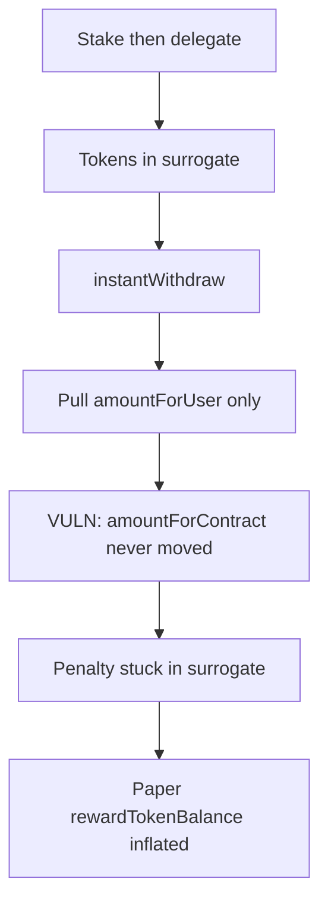

# BOB Staking — instantWithdraw does not transfer amountForContract

> **Vulnerability classes:** vuln/logic/frozen-funds · reward-accounting · temporary

> **Reproduction:** a self-contained Foundry PoC that compiles & runs in an
> isolated project with **only `forge-std`** — no fork, no RPC, no `anvil_state`.
> Full trace: [output.txt](output.txt). PoC:
> [test/63717-c-01-instantwithdraw-does-not-transfer-amountforcontract-lo_exp.sol](test/63717-c-01-instantwithdraw-does-not-transfer-amountforcontract-lo_exp.sol).

<!-- non-defihacklabs -->
<!-- source-auditvault: https://github.com/Auditware/AuditVault/blob/main/findings/63717-c-01-instantwithdraw-does-not-transfer-amountforcontract-lo.md -->
<!-- date: 2025-10 -->

**AuditVault taxonomy:** `severity/high` · `sector/staking` · `sector/governance` · `platform/pashov` · `frozen-funds` · `reward-accounting` · `reentrancy-guard` · `vote-delegation-loop`

---

## Key info

| | |
|---|---|
| **Impact** | **HIGH** — early-withdraw penalty permanently stuck in surrogate; paper rewards inflated |
| **Protocol** | BOB Staking |
| **Vulnerable code** | `BobStaking.instantWithdraw` — missing transfer of `_amountForContract` from surrogate |
| **Bug class** | Incomplete token path when stake is delegated |
| **Finding** | Pashov BOB-Staking security review 2025-10-18 · #63717 |
| **Report** | [Pashov BOB-Staking review](https://github.com/pashov/audits/blob/master/team/md/BOB-Staking-security-review_2025-10-18.md) |
| **Source** | [AuditVault](https://github.com/Auditware/AuditVault/blob/main/findings/63717-c-01-instantwithdraw-does-not-transfer-amountforcontract-lo.md) |
| **Status** | Audit finding — resolved per report. Reproduced as a reduced local synthetic. |
| **Compiler** | `^0.8.24` (PoC) |

---

## TL;DR

1. Delegated stake lives in a `DelegationSurrogate`.
2. `instantWithdraw` pulls only `_amountForUser` from the surrogate.
3. `_amountForContract` (penalty) is never transferred back to BobStaking.
4. Penalty tokens freeze in the surrogate while `rewardTokenBalance` is increased on paper.

---

## The vulnerable code

```solidity
if (stakers[_stakeMsgSender()].governanceDelegatee != address(0)) {
    DelegationSurrogate surrogate = storedSurrogates[...];
    IERC20(stakingToken).safeTransferFrom(address(surrogate), _receiver, _amountForUser);
    // @> VULN: missing safeTransferFrom(surrogate, address(this), _amountForContract)
} else {
    IERC20(stakingToken).safeTransfer(_receiver, _amountForUser);
}
```

---

## Root cause

The delegated and non-delegated withdraw paths are asymmetric: only the non-delegated path leaves the penalty in the staking contract naturally. The delegated path never repatriates it.

## Preconditions

- Staker has non-zero stake and a non-zero governance delegatee (tokens in surrogate).
- Instant withdraw allowed (not locked / no unbond started).
- `instantWithdrawalRate &lt; 100` so a non-zero penalty exists.

## Attack walkthrough

1. Stake 1 BOB; whitelist and set a governance delegatee (tokens → surrogate).
2. Call `instantWithdraw` (50% rate).
3. User receives 0.5 BOB; 0.5 BOB remains in the surrogate forever.
4. Staking contract balance unchanged; `rewardTokenBalance` claims +0.5 on paper.

## Diagrams



---

## Impact

Penalty value that should fund rewards is permanently unrecoverable. Accounting overstates reward inventory, risking insolvency for later claimers.

## Sources

- [AuditVault finding #63717](https://github.com/Auditware/AuditVault/blob/main/findings/63717-c-01-instantwithdraw-does-not-transfer-amountforcontract-lo.md)
- [Pashov BOB-Staking security review 2025-10-18](https://github.com/pashov/audits/blob/master/team/md/BOB-Staking-security-review_2025-10-18.md)
