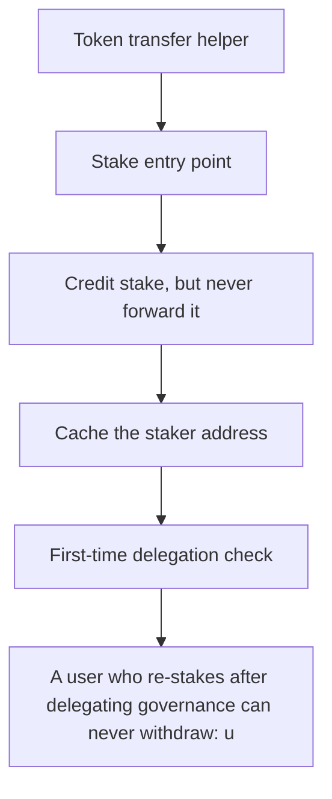

# BOB: A user who re-stakes after delegating governance can never withdraw: unbond()/instantWithd

> **Vulnerability classes:** vuln/locked-funds
>
> **Reproduction:** a faithful minimal reproduction of the vulnerable finding — the vulnerable function is reproduced **verbatim** (marked `@>`) with faithful minimal doubles; local deploy, no fork.

<!-- source-auditvault: https://github.com/Auditware/AuditVault/blob/main/findings/63718-c-02-stakes-not-forwarded-post-delegation-positions-unwithdr.md -->

## Root cause

A user who re-stakes after delegating governance can never withdraw: unbond()/instantWithdraw() revert because the surrogate holds only the 100-token pre-delegation portion while the exit paths pull the full 150, permanently freezing 150 staked tokens (50 stranded in BobStaking + 100 in the surrogate).

```solidity
    function stake(uint256 _amount, address receiver, uint256 lockPeriod) external {
        lockPeriod; // unused in this minimal repro
        IERC20(_stakingToken).safeTransferFrom(_stakeMsgSender(), address(this), _amount);
        stakers[receiver].amountStaked += _amount; // @> new stake credited but NOT forwarded to the surrogate when governanceDelegatee != 0 -> custody diverges from accounting
    }

```

## Why it's exploitable here

A user who re-stakes after delegating governance can never withdraw: unbond()/instantWithdraw() revert because the surrogate holds only the 100-token pre-delegation portion while the exit paths pull the full 150, permanently freezing 150 staked tokens (50 stranded in BobStaking + 100 in the surrogate).

## Attack path



## Marked-line walkthrough (Playground)

The EVM Playground pins each step to the exact executed source line in `0x671d353a77…`:

1. **L43** — Token transfer helper: Setup: a checked `transferFrom` wrapper used to move staked tokens between the user, the contract and the surrogate.
2. **L142** — Stake entry point: `stake` takes an amount and receiver; once the user has delegated, new stakes must be forwarded into their delegation surrogate.
3. **L145** — Credit stake, but never forward it: Root cause: stake bumps `amountStaked` to 150 but never forwards the new tokens to the surrogate, which still holds only the pre-delegation 100.
4. **L151** — Cache the staker address: Setup: caches the caller as the staker for the delegation branch that follows.
5. **L154** — First-time delegation check: Branches on whether a surrogate exists; only the first delegation creates one, so later stakes take the skip path and never get routed in.
6. **L155** — Deploy the delegation surrogate: On first delegation, deploys a `DelegationSurrogate` for `_delegatee` — the 100-token portion is all that ever lands there.
7. **L177** — Exit pulls full stake from surrogate: Withdrawal reads the user's surrogate and tries to pull all 150, but it holds only 100, so `unbond`/`instantWithdraw` revert and funds freeze.

## PoC

Registry (Foundry, local deploy — verbatim vulnerable source + harm-asserting test + negative control):

```bash
cd 63718-c-02-stakes-not-forwarded-post-delegation-positions-unwithdr_exp
forge test -vvv
```

The browser Playground replays the same synthetic opcode-for-opcode and measures the harm: **A user who re-stakes after delegating governance can never withdraw: unbond()/instantWithdraw() revert because the surrogate holds only the **. Both gates are green (registry `forge test` PASS + Playground `_verify-poc` **VERDICT: PASS**).
