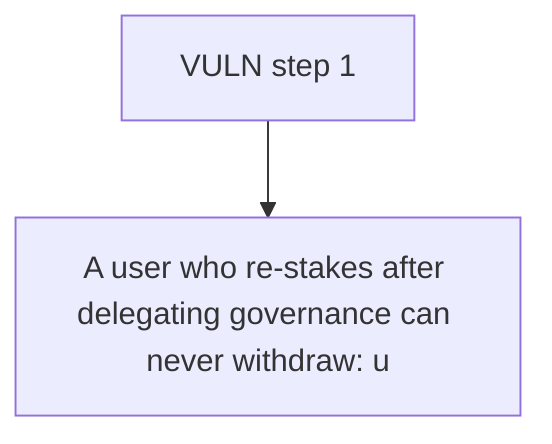

# BOB: A user who re-stakes after delegating governance can never withdraw: unbond()/instantWithd

> **Vulnerability classes:** vuln/locked-funds
>
> **Reproduction:** a faithful minimal reproduction of the vulnerable finding — the vulnerable function is reproduced **verbatim** (marked `@>`) with faithful minimal doubles; local deploy, no fork.

<!-- source-auditvault: https://github.com/Auditware/AuditVault/blob/main/findings/63718-c-02-stakes-not-forwarded-post-delegation-positions-unwithdr.md -->

## Root cause

A user who re-stakes after delegating governance can never withdraw: unbond()/instantWithdraw() revert because the surrogate holds only the 100-token pre-delegation portion while the exit paths pull the full 150, permanently freezing 150 staked tokens (50 stranded in BobStaking + 100 in the surrogate).

```solidity
    function stake(uint256 _amount, address receiver, uint256 lockPeriod) external {
        lockPeriod; // unused in this minimal repro
        IERC20(_stakingToken).safeTransferFrom(_stakeMsgSender(), address(this), _amount);
        stakers[receiver].amountStaked += _amount; // @> new stake credited but NOT forwarded to the surrogate when governanceDelegatee != 0 -> custody diverges from accounting
    }

```

## Why it's exploitable here

A user who re-stakes after delegating governance can never withdraw: unbond()/instantWithdraw() revert because the surrogate holds only the 100-token pre-delegation portion while the exit paths pull the full 150, permanently freezing 150 staked tokens (50 stranded in BobStaking + 100 in the surrogate).

## Attack path



## Marked-line walkthrough (Playground)

The EVM Playground pins each step to the exact executed source line in `0x671d353a77…`:

1. **L145** — VULN step 1: new stake credited but NOT forwarded to the surrogate when governanceDelegatee != 0 -> custody diverges from accounting

## PoC

Registry (Foundry, local deploy — verbatim vulnerable source + harm-asserting test + negative control):

```bash
cd 63718-c-02-stakes-not-forwarded-post-delegation-positions-unwithdr_exp
forge test -vvv
```

The browser Playground replays the same synthetic opcode-for-opcode and measures the harm: **A user who re-stakes after delegating governance can never withdraw: unbond()/instantWithdraw() revert because the surrogate holds only the **. Both gates are green (registry `forge test` PASS + Playground `_verify-poc` **VERDICT: PASS**).
