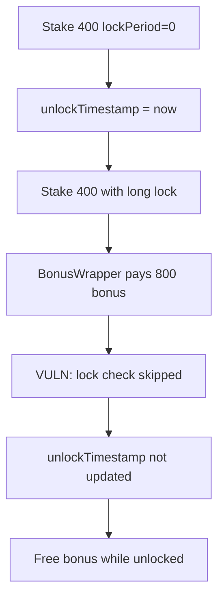

# BOB Staking — Bonuses obtainable without proper locking

> **Vulnerability classes:** vuln/logic/wrong-condition · reward-theft · account-ownership

> **Reproduction:** a self-contained Foundry PoC that compiles & runs in an
> isolated project with **only `forge-std`** — no fork, no RPC, no `anvil_state`.
> Full trace: [output.txt](output.txt). PoC:
> [test/63719-h-01-bonuses-obtainable-without-proper-locking-due-to-flawed_exp.sol](test/63719-h-01-bonuses-obtainable-without-proper-locking-due-to-flawed_exp.sol).

<!-- non-defihacklabs -->
<!-- source-auditvault: https://github.com/Auditware/AuditVault/blob/main/findings/63719-h-01-bonuses-obtainable-without-proper-locking-due-to-flawed.md -->
<!-- date: 2025-10 -->

**AuditVault taxonomy:** `severity/high` · `sector/staking` · `platform/pashov` · `wrong-condition` · `reward-theft` · `reward-accounting` · `timestamp-dependence`

---

## Key info

| | |
|---|---|
| **Impact** | **HIGH** — max-lock bonus paid while stake remains unlocked |
| **Protocol** | BOB Staking + BonusWrapper |
| **Vulnerable code** | `BobStaking.stake` inconsistent-lock guard |
| **Bug class** | Wrong condition: only enforces lock match when stored `lockPeriod != 0` |
| **Finding** | Pashov BOB-Staking security review 2025-10-18 · #63719 |
| **Report** | [Pashov BOB-Staking review](https://github.com/pashov/audits/blob/master/team/md/BOB-Staking-security-review_2025-10-18.md) |
| **Source** | [AuditVault](https://github.com/Auditware/AuditVault/blob/main/findings/63719-h-01-bonuses-obtainable-without-proper-locking-due-to-flawed.md) |
| **Status** | Audit finding — resolved per report. Reproduced as a reduced local synthetic. |
| **Compiler** | `^0.8.24` (PoC) |

---

## TL;DR

1. First stake with `lockPeriod = 0` sets `unlockTimestamp = now` and stores `lockPeriod = 0`.
2. Second stake with a long lock period still passes the consistency check (guard requires stored lock ≠ 0).
3. `unlockTimestamp` is **not** updated on subsequent stakes.
4. `BonusWrapper` pays the long-lock bonus while the position remains unlocked.

---

## The vulnerable code

```solidity
// FIX: also reject when amountStaked > 0 && lockPeriod differs
if (stakers[receiver].lockPeriod != 0 && stakers[receiver].lockPeriod != lockPeriod) {
    // @> VULN: skipped entirely when stored lockPeriod == 0
    revert InconsistentLockPeriod();
}
```

---

## Root cause

Lock-period immutability is only enforced for non-zero prior locks. Zero is treated as "unset" even after a successful stake that already initialized unlock timing.

## Preconditions

- Bonus period still active.
- `lockPeriod = 0` is a valid allowed period.
- Reward owner has approved / funded the max bonus.

## Attack walkthrough

1. Stake 400 BOB via BonusWrapper with `lockPeriod = 0` (no bonus, unlocked).
2. Stake another 400 with `lockPeriod = 21 * 30 days`.
3. Wrapper pulls 800 BOB bonus and stakes total; BobStaking accepts without updating lock.
4. Position holds principal + free bonus while still unlocked.

## Diagrams



---

## Impact

`rewardOwner` is drained for lock bonuses without users committing capital to the advertised lock. Timing variants (dust long lock, then large add near expiry) amplify the theft.

## Sources

- [AuditVault finding #63719](https://github.com/Auditware/AuditVault/blob/main/findings/63719-h-01-bonuses-obtainable-without-proper-locking-due-to-flawed.md)
- [Pashov BOB-Staking security review 2025-10-18](https://github.com/pashov/audits/blob/master/team/md/BOB-Staking-security-review_2025-10-18.md)
