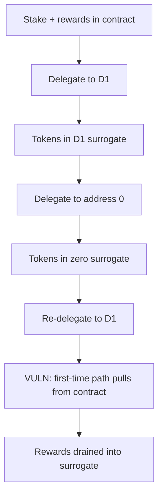

# BOB Staking — Delegating to address(0) empties contract via alterGovernanceDelegatee

> **Vulnerability classes:** vuln/logic/missing-check · direct-drain · vote-delegation-loop

> **Reproduction:** a self-contained Foundry PoC that compiles & runs in an
> isolated project with **only `forge-std`** — no fork, no RPC, no `anvil_state`.
> Full trace: [output.txt](output.txt). PoC:
> [test/63720-h-02-delegating-to-address0-empties-contract-via-altergovern_exp.sol](test/63720-h-02-delegating-to-address0-empties-contract-via-altergovern_exp.sol).

<!-- non-defihacklabs -->
<!-- source-auditvault: https://github.com/Auditware/AuditVault/blob/main/findings/63720-h-02-delegating-to-address0-empties-contract-via-altergovern.md -->
<!-- date: 2025-10 -->

**AuditVault taxonomy:** `severity/high` · `sector/staking` · `sector/governance` · `platform/pashov` · `missing` · `direct-drain` · `reward-accounting` · `vote-delegation-loop`

---

## Key info

| | |
|---|---|
| **Impact** | **HIGH** — attacker drains staking-contract balance (rewards / other stakes) |
| **Protocol** | BOB Staking |
| **Vulnerable code** | `BobStaking.alterGovernanceDelegatee` — allows `address(0)` and re-pulls from contract |
| **Bug class** | Missing zero-address reject + wrong "first delegation" branch after undelegate |
| **Finding** | Pashov BOB-Staking security review 2025-10-18 · #63720 |
| **Report** | [Pashov BOB-Staking review](https://github.com/pashov/audits/blob/master/team/md/BOB-Staking-security-review_2025-10-18.md) |
| **Source** | [AuditVault](https://github.com/Auditware/AuditVault/blob/main/findings/63720-h-02-delegating-to-address0-empties-contract-via-altergovern.md) |
| **Status** | Audit finding — resolved per report (disable `address(0)`). Reproduced as a reduced local synthetic. |
| **Compiler** | `^0.8.24` (PoC) |

---

## TL;DR

1. First non-zero delegation moves the staker's tokens contract → surrogate.
2. Setting delegatee to `address(0)` is allowed; tokens move to a zero surrogate.
3. Re-delegating to a non-zero address sees `governanceDelegatee == 0` and treats it as a **first** delegation.
4. The contract transfers `amountStaked` from its **own** balance (rewards) into the new surrogate — draining the vault. Repeat to empty it.

---

## The vulnerable code

```solidity
function alterGovernanceDelegatee(address newDelegatee) external {
    // FIX: revert if newDelegatee == address(0)
    DelegationSurrogate newSurrogate = _fetchOrDeploySurrogate(newDelegatee);

    if (staker.governanceDelegatee == address(0)) { // @> VULN after prior 0-delegate
        IERC20(stakingToken).safeTransfer(address(newSurrogate), staker.amountStaked);
    } else {
        // move between surrogates
    }
    staker.governanceDelegatee = newDelegatee;
}
```

---

## Root cause

`address(0)` is both the "not yet delegated" sentinel and an allowed target. After a real undelegate-to-zero, the user's tokens sit in the zero surrogate, but the next re-delegate reuses the first-time path that pulls from the main contract.

## Preconditions

- Attacker has non-zero stake.
- At least one whitelisted non-zero delegatee.
- Contract holds extra tokens (rewards or other stakers) ≥ `amountStaked` per cycle.

## Attack walkthrough

1. Deposit 1000e18 rewards; attacker stakes 1e18.
2. Delegate to a whitelisted address (stake leaves contract).
3. Delegate to `address(0)` (tokens → zero surrogate).
4. Delegate again to the non-zero address → pulls 1e18 from rewards into the surrogate.
5. Contract rewards fall from 1000 → 999; repeat to empty.

## Diagrams



---

## Impact

Any staker can siphon reward inventory (and eventually other users' undelegated stake) by cycling `D → 0 → D`. Full vault empty is possible with enough cycles.

## Sources

- [AuditVault finding #63720](https://github.com/Auditware/AuditVault/blob/main/findings/63720-h-02-delegating-to-address0-empties-contract-via-altergovern.md)
- [Pashov BOB-Staking security review 2025-10-18](https://github.com/pashov/audits/blob/master/team/md/BOB-Staking-security-review_2025-10-18.md)
