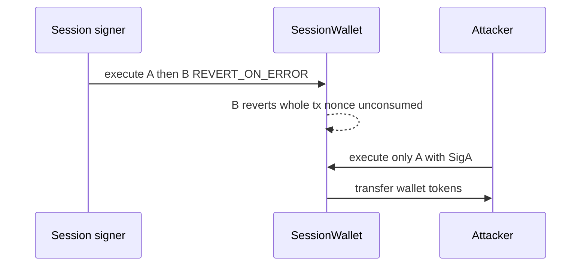

# Sequence — partial session-signature replay / frontrun (H-02)

> **Vulnerability classes:** vuln/signature/partial-replay · vuln/mev/frontrun · vuln/bridge/replay · vuln/atomicity

> **Reproduction:** self-contained Foundry PoC with only `forge-std`.
> Full trace: [output.txt](output.txt). PoC:
> [test/63761-h-02-partial-signature-replayfrontrunning-attack-on-session_exp.sol](test/63761-h-02-partial-signature-replayfrontrunning-attack-on-session_exp.sol).

<!-- non-defihacklabs -->
<!-- source-auditvault: https://github.com/Auditware/AuditVault/blob/main/findings/63761-h-02-partial-signature-replayfrontrunning-attack-on-session.md -->
<!-- date: 2025-10 -->

**AuditVault taxonomy:** `lang/solidity` · `platform/code4rena` · `has/github` · `has/poc` · `severity/high` · `sector/account` · `sector/dex` · `sector/staking` · genome: `replay` · `griefing` · `frontrun` · `permit-fork-replay` · `fot-slippage`

---

## Key info

| | |
|---|---|
| **Impact** | **HIGH** — multi-call session that reverts on a later `BEHAVIOR_REVERT_ON_ERROR` leaves per-call signatures reusable; attacker executes a prefix of the payload alone and steals funds / breaks atomicity |
| **Protocol** | [Sequence](https://code4rena.com/reports/2025-10-sequence) — `Calls.sol` + `SessionSig.sol` |
| **Vulnerable code** | Nonce bumped before execution (undone on full revert) + per-call `hashCallWithReplayProtection` not bound to full payload |
| **Bug class** | Partial signature replay / mempool frontrun of multi-call sessions |
| **Finding** | Code4rena — Sequence 2025-10 · H-02 · reporter **montecristo** |
| **Report** | [2025-10-sequence](https://code4rena.com/reports/2025-10-sequence) |
| **Source** | [AuditVault](https://github.com/Auditware/AuditVault/blob/main/findings/63761-h-02-partial-signature-replayfrontrunning-attack-on-session.md) |
| **Status** | Audit finding. Local synthetic reduction of the session execute + per-call sig path. |
| **Compiler** | `^0.8.24` (PoC) |
| **Repo@commit** | [code-423n4/2025-10-sequence@b0e5fb15](https://github.com/code-423n4/2025-10-sequence/tree/b0e5fb15bf6735ec9aaba02f5eca28a7882d815d) |

---

## TL;DR

1. `Calls.execute` bumps the nonce, validates the session signature, then runs calls.
2. A later call with `BEHAVIOR_REVERT_ON_ERROR` reverts the **entire** transaction → nonce not consumed.
3. Session sigs are recovered **per call index**, not over the full payload.
4. Attacker trims `[A,B]` + `[SigA,SigB]` down to `[A]` + `[SigA]` and re-submits.
5. HARM: Call A alone transfers 100 WETH from the wallet to the attacker.

---

## The vulnerable code

```solidity
nonce = usedNonce + 1; // @> VULN: undone if a later call reverts the tx
// ...
revert Reverted(i); // full revert → nonce unconsumed
// ...
return keccak256(abi.encodePacked(DOMAIN, space, nonce, callIdx, ...)); // @> VULN: per-call only
```

**Fix:** bind each session call signature to the complete payload hash.

---

## Root cause

Atomic multi-call semantics are enforced only by full-tx revert, but authorization is per-call. When the revert also rolls back nonce consumption, every proper prefix of a signed multi-call remains a valid standalone payload.

---

## Preconditions

- A multi-call session payload with per-call session signatures.
- At least one later call uses `BEHAVIOR_REVERT_ON_ERROR` and fails (or attacker frontruns a subset from the mempool).

---

## Attack walkthrough

1. Session signs `[transfer tokens to attacker, alwaysRevert]` both with REVERT_ON_ERROR.
2. Full execute reverts on call 1; nonce stays 0; wallet still funded.
3. Attacker submits only call 0 + Sig0.
4. Transfer succeeds; wallet drained.

---

## Diagrams



---

## Impact

Financial loss (partial execution of transfers/swaps), state corruption (broken atomicity), and mempool frontrun grief of legitimate multi-call sessions.

---

## Sources

- [AuditVault finding #63761](https://github.com/Auditware/AuditVault/blob/main/findings/63761-h-02-partial-signature-replayfrontrunning-attack-on-session.md)
- [Code4rena 2025-10-sequence](https://code4rena.com/reports/2025-10-sequence)
- Source: [code-423n4/2025-10-sequence@b0e5fb15](https://github.com/code-423n4/2025-10-sequence/blob/b0e5fb15bf6735ec9aaba02f5eca28a7882d815d/src/modules/Calls.sol)
