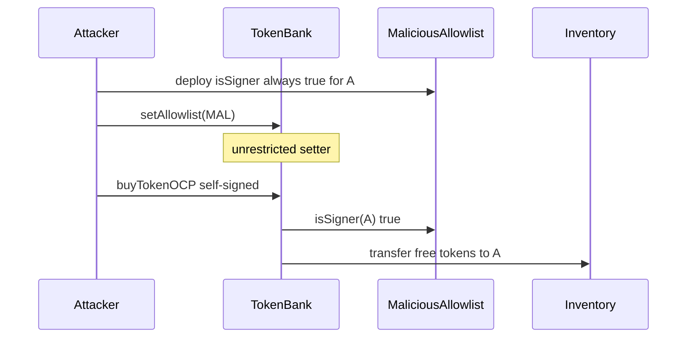

# Remora — unrestricted `SignatureValidator::setAllowlist` enables free `buyTokenOCP`

> **Vulnerability classes:** vuln/access-control/missing-modifier · vuln/auth/allowlist-spoof · vuln/logic/free-mint

> **Reproduction:** a self-contained Foundry PoC that compiles & runs in an
> isolated project with **only `forge-std`** — no fork, no RPC, no `anvil_state`.
> Full trace: [output.txt](output.txt). PoC:
> [test/63776-signaturevalidatorsetallowlist-is-unrestricted-leading-to-fr_exp.sol](test/63776-signaturevalidatorsetallowlist-is-unrestricted-leading-to-fr_exp.sol).

<!-- non-defihacklabs -->
<!-- source-auditvault: https://github.com/Auditware/AuditVault/blob/main/findings/63776-signaturevalidatorsetallowlist-is-unrestricted-leading-to-fr.md -->
<!-- date: 2025-10 -->

**AuditVault taxonomy:** `lang/solidity` · `platform/cyfrin` · `has/github` · `has/poc` · `severity/high` · `sector/stable` · `sector/staking` · genome: `missing-modifier` · `direct-drain` · `reward-accounting`

---

## Key info

| | |
|---|---|
| **Impact** | **HIGH** — any address can call `setAllowlist` on `TokenBank`, install a malicious allowlist, self-sign `buyTokenOCP`, and drain central-token inventory for free |
| **Protocol** | [Remora Dynamic Tokens](https://github.com/remora-projects/remora-dynamic-tokens) |
| **Vulnerable code** | `SignatureValidator::setAllowlist` (inherited by `TokenBank`) — external, no access control |
| **Bug class** | Missing access control on allowlist mutation → signature-authority spoof → free mint |
| **Finding** | Cyfrin — Remora Dynamic Tokens v2.1, 2025-10-22 · #63776 · reporter **0xStalin** |
| **Report** | [Cyfrin Remora report](https://github.com/solodit/solodit_content/blob/main/reports/Cyfrin/2025-10-22-cyfrin-remora-dynamic-tokens-v2.1.md) |
| **Source** | [AuditVault](https://github.com/Auditware/AuditVault/blob/main/findings/63776-signaturevalidatorsetallowlist-is-unrestricted-leading-to-fr.md) |
| **Status** | Audit finding — fixed at commit `cc447da`. Reproduced here as a standalone local PoC. |
| **Compiler** | `^0.8.24` (PoC) |

---

## TL;DR

1. `SignatureValidator.setAllowlist` is `external` with **no** `restricted` / onlyOwner guard.
2. `TokenBank` inherits it, so anyone can point the bank at a `MaliciousAllowlist` whose `isSigner` returns true for the attacker.
3. The attacker signs a `BuyToken` digest and calls `buyTokenOCP` — the off-chain-payment path skips stablecoin transfer.
4. HARM: the entire central-token inventory is transferred to the attacker for free.

---

## The vulnerable code

```solidity
function setAllowlist(address allowlist_) external {
    if (allowlist_ == address(0)) revert InvalidAddress();
    if (allowlist != allowlist_) {
        allowlist = allowlist_; // @> VULN: unrestricted
        emit AllowlistSet(allowlist_);
    }
}
```

**Fix:** make `_setAllowlist` internal and expose an external `restricted` wrapper on `TokenBank`.

---

## Root cause

Authorization for off-chain-payment buys is entirely delegated to `allowlist.isSigner(signer)`. Making the allowlist pointer world-writable collapses that trust root.

---

## Preconditions

- `TokenBank` holds central-token inventory.
- Attacker can deploy a contract and call `setAllowlist`.

---

## Attack walkthrough

1. Deploy `MaliciousAllowlist(attackerSigner)`.
2. Call `tokenBank.setAllowlist(malicious)`.
3. Sign `BuyToken(investor, token, amount)` with the attacker key.
4. Call `buyTokenOCP` — inventory moves to the investor with no payment.

---

## Diagrams



---

## Impact

Complete drain of remaining central tokens via free `buyTokenOCP`. Same primitive can abuse `ReferralManager` bonuses.

---

## Sources

- [AuditVault finding #63776](https://github.com/Auditware/AuditVault/blob/main/findings/63776-signaturevalidatorsetallowlist-is-unrestricted-leading-to-fr.md)
- [Cyfrin Remora Dynamic Tokens v2.1](https://github.com/solodit/solodit_content/blob/main/reports/Cyfrin/2025-10-22-cyfrin-remora-dynamic-tokens-v2.1.md)
- Fix: [remora-dynamic-tokens@cc447da](https://github.com/remora-projects/remora-dynamic-tokens/commit/cc447da9fca1a997ffbb34f4d099be8f7dce7133)
