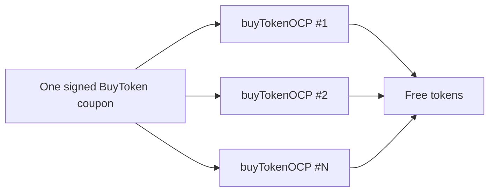

# Remora — `buyTokenOCP` signatures reusable forever (missing nonce)

> **Vulnerability classes:** vuln/signature/missing-nonce · vuln/auth/replay · vuln/logic/free-mint

> **Reproduction:** self-contained Foundry PoC with only `forge-std`.
> Full trace: [output.txt](output.txt). PoC:
> [test/63777-signatures-on-tokenbank-and-allowlist-can-be-reused-in-perpe_exp.sol](test/63777-signatures-on-tokenbank-and-allowlist-can-be-reused-in-perpe_exp.sol).

<!-- non-defihacklabs -->
<!-- source-auditvault: https://github.com/Auditware/AuditVault/blob/main/findings/63777-signatures-on-tokenbank-and-allowlist-can-be-reused-in-perpe.md -->
<!-- date: 2025-10 -->

**AuditVault taxonomy:** `lang/solidity` · `platform/cyfrin` · `has/github` · `has/poc` · `severity/high` · `sector/perpetuals` · `sector/stable` · genome: `missing-modifier` · `role-bypass` · `permit-fork-replay`

---

## Key info

| | |
|---|---|
| **Impact** | **HIGH** — a single off-chain-payment signature can be replayed indefinitely to mint free tokens via `buyTokenOCP` |
| **Protocol** | [Remora Dynamic Tokens](https://github.com/remora-projects/remora-dynamic-tokens) |
| **Vulnerable code** | `TokenBank.verifySignature` — struct hash is `(investor, token, amount)` with no nonce / used-digest map |
| **Bug class** | Signature replay (missing nonce) |
| **Finding** | Cyfrin — Remora Dynamic Tokens v2.1, 2025-10-22 · #63777 · reporter **0xStalin** |
| **Report** | [Cyfrin Remora report](https://github.com/solodit/solodit_content/blob/main/reports/Cyfrin/2025-10-22-cyfrin-remora-dynamic-tokens-v2.1.md) |
| **Source** | [AuditVault](https://github.com/Auditware/AuditVault/blob/main/findings/63777-signatures-on-tokenbank-and-allowlist-can-be-reused-in-perpe.md) |
| **Status** | Fixed at commit `4f73c1d`. Local synthetic PoC. |
| **Compiler** | `^0.8.24` (PoC) |

---

## TL;DR

1. `buyTokenOCP` verifies an EIP-712-style `BuyToken(investor, token, amount)` signature and skips on-chain payment.
2. The hash **omits a nonce** and nothing marks the digest as used.
3. The same signature is submitted N times → N free token purchases.
4. HARM in the PoC: one signature buys 5 inventory tokens.

---

## The vulnerable code

```solidity
bytes32 structHash = keccak256(
    abi.encode(BUY_TOKEN_TYPEHASH, investor, token, amount)
); // @> VULN: no nonce
```

**Fix:** include and bump a per-investor nonce (or store used digests).

---

## Root cause

Off-chain-payment authorization is a pure function of static fields. Without a one-time nonce, each signature is a free mint coupon of unlimited use.

---

## Preconditions

- A valid authorized-signer signature for `(investor, token, amount)`.
- Sufficient TokenBank inventory.

---

## Attack walkthrough

1. Obtain one signed `BuyToken` for 1 unit.
2. Call `buyTokenOCP` with that signature five times.
3. Receive five free tokens; inventory is drained.

---

## Diagrams



---

## Impact

Unbounded free mint of central tokens for the cost of a single off-chain signature. Same missing-nonce pattern on `AllowList` lets removed admins re-add themselves.

---

## Sources

- [AuditVault finding #63777](https://github.com/Auditware/AuditVault/blob/main/findings/63777-signatures-on-tokenbank-and-allowlist-can-be-reused-in-perpe.md)
- [Cyfrin Remora Dynamic Tokens v2.1](https://github.com/solodit/solodit_content/blob/main/reports/Cyfrin/2025-10-22-cyfrin-remora-dynamic-tokens-v2.1.md)
- Fix: [remora-dynamic-tokens@4f73c1d](https://github.com/remora-projects/remora-dynamic-tokens/commit/4f73c1de5e9b0beea6cdc0af3eb43bc4546ea203)
