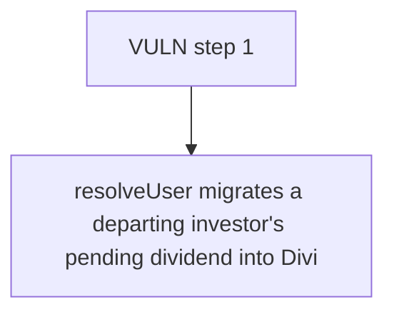

# Remora: resolveUser migrates a departing investor's pending dividend into DividendManager._resolve

> **Vulnerability classes:** vuln/locked-funds · vuln/reward-accounting
>
> **Reproduction:** a faithful minimal reproduction of the vulnerable finding — the vulnerable function is reproduced **verbatim** (marked `@>`) with faithful minimal doubles; local deploy, no fork.

<!-- source-auditvault: https://github.com/Auditware/AuditVault/blob/main/findings/63778-pending-payouts-when-resolving-an-investor-are-lost-because.md -->

## Root cause

resolveUser migrates a departing investor's pending dividend into DividendManager._resolvedPay[newAddress], which no function ever reads, so P=1,000 USDC (1000000000 units) stays permanently locked in the manager and the new address can never claim it; a second resolve to the same address also overwrites and destroys the prior amount.

```solidity

    // ── VERBATIM vulnerable function from the finding ──────────────────────────
    function _resolvePay(address oldAddress, address newAddress) internal {
        _getHolderManagementStorage()._resolvedPay[newAddress] = SafeCast.toUint128(_claimPayout(oldAddress)); // @> migrates payout into _resolvedPay[newAddress], but NO function ever reads it -> funds locked; also overwrites any prior value
        emit PaymentResolved(oldAddress, newAddress);
    }
```

## Why it's exploitable here

resolveUser migrates a departing investor's pending dividend into DividendManager._resolvedPay[newAddress], which no function ever reads, so P=1,000 USDC (1000000000 units) stays permanently locked in the manager and the new address can never claim it; a second resolve to the same address also overwrites and destroys the prior amount.

## Attack path



## Marked-line walkthrough (Playground)

The EVM Playground pins each step to the exact executed source line in `0x671d353a77…`:

1. **L122** — VULN step 1: migrates payout into _resolvedPay[newAddress], but NO function ever reads it -> funds locked; also overwrites any prior value

## PoC

Registry (Foundry, local deploy — verbatim vulnerable source + harm-asserting test + negative control):

```bash
cd 63778-pending-payouts-when-resolving-an-investor-are-lost-because_exp
forge test -vvv
```

The browser Playground replays the same synthetic opcode-for-opcode and measures the harm: **resolveUser migrates a departing investor's pending dividend into DividendManager._resolvedPay[newAddress], which no function ever reads, so**. Both gates are green (registry `forge test` PASS + Playground `_verify-poc` **VERDICT: PASS**).
