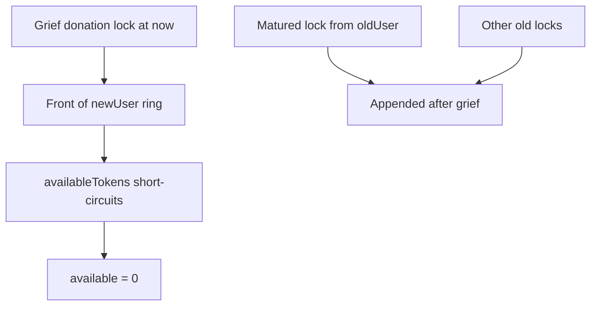

# Remora — resolveUser lock migration can be griefed to extend lock duration

> **Vulnerability classes:** vuln/dos/griefing · vuln/logic/ordering · vuln/timestamp

> **Reproduction:** self-contained Foundry PoC with only `forge-std`.
> Full trace: [output.txt](output.txt). PoC:
> [test/63779-migrating-the-existing-locks-for-an-investor-when-is-resolve_exp.sol](test/63779-migrating-the-existing-locks-for-an-investor-when-is-resolve_exp.sol).

<!-- non-defihacklabs -->
<!-- source-auditvault: https://github.com/Auditware/AuditVault/blob/main/findings/63779-migrating-the-existing-locks-for-an-investor-when-is-resolve.md -->
<!-- date: 2025-10 -->

**AuditVault taxonomy:** `lang/solidity` · `platform/cyfrin` · `has/github` · `has/poc` · `severity/high` · `sector/governance` · `sector/stable` · genome: `griefing` · `temporary` · `frontrun-exposure` · `timestamp-dependence`

---

## Key info

| | |
|---|---|
| **Impact** | **HIGH** — frontrun donation to `newAddress` plants a fresh lock that blocks all migrated matured locks until the donation expires |
| **Protocol** | [Remora Dynamic Tokens](https://github.com/remora-projects/remora-dynamic-tokens) |
| **Vulnerable code** | `LockUpManager._newAccountSameLocks` append-only migration + `availableTokens` short-circuit |
| **Bug class** | Ordering grief / frontrun during investor resolve |
| **Finding** | Cyfrin — Remora Dynamic Tokens v2.1, 2025-10-22 · #63779 · reporter **0xStalin** |
| **Report** | [Cyfrin Remora report](https://github.com/solodit/solodit_content/blob/main/reports/Cyfrin/2025-10-22-cyfrin-remora-dynamic-tokens-v2.1.md) |
| **Source** | [AuditVault](https://github.com/Auditware/AuditVault/blob/main/findings/63779-migrating-the-existing-locks-for-an-investor-when-is-resolve.md) |
| **Status** | Fixed at commit `3d6d874`. Local synthetic PoC. |
| **Compiler** | `^0.8.24` (PoC) |

---

## TL;DR

1. `resolveUser` migrates locks by **appending** old locks after any locks already on `newAddress`.
2. `availableTokens` stops at the first unexpired entry.
3. A frontrun transfer/donation to `newAddress` plants a fresh lock at the front.
4. All migrated (already matured) locks stay blocked until the grief lock expires.
5. HARM: `availableTokens(newUser) == 0` even though a migrated lock is fully matured.

---

## The vulnerable code

```solidity
newData.tokenLockUp[newData.endInd++] =
    oldData.tokenLockUp[oldData.startInd + i]; // @> VULN: append-only
// ...
} else {
    break; // @> VULN: short-circuit on first unexpired lock
}
```

**Fix:** merge locks ordered by `time` (or prevent `newAddress` from holding tokens before resolve).

---

## Root cause

Migration assumes `newAddress` has no prior locks (or that append preserves chronological order). Combined with short-circuit unlock, a single newer front entry freezes older matured ones.

---

## Preconditions

- Old user has matured locks.
- Attacker can transfer/donate 1 token to `newAddress` before `resolveUser`.

---

## Attack walkthrough

1. Old user has 4 locks; one is fully matured.
2. Griefer donates 1 token to `newAddress` (fresh lock at `now`).
3. Admin calls `resolveUser(old, new)` — appends old locks after the grief lock.
4. `availableTokens(new) == 0` despite a matured migrated entry.

---

## Diagrams



---

## Impact

Investor funds remain locked far longer than their original lock schedule after a legitimate address resolve — a griefing / temporary freeze of migrated balances.

---

## Sources

- [AuditVault finding #63779](https://github.com/Auditware/AuditVault/blob/main/findings/63779-migrating-the-existing-locks-for-an-investor-when-is-resolve.md)
- [Cyfrin Remora Dynamic Tokens v2.1](https://github.com/solodit/solodit_content/blob/main/reports/Cyfrin/2025-10-22-cyfrin-remora-dynamic-tokens-v2.1.md)
- Fix: [remora-dynamic-tokens@3d6d874](https://github.com/remora-projects/remora-dynamic-tokens/commit/3d6d87430bbabb16afce37e5cbfe968093fc2d24)
