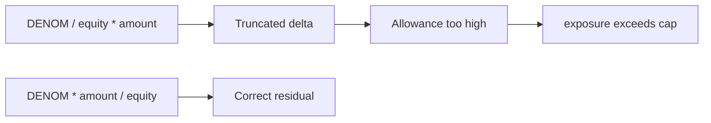

# Remora — div-before-mul in `FiveFiftyRule::_updateEntityAllowance` exceeds caps

> **Vulnerability classes:** vuln/arithmetic/division-before-multiply · vuln/arithmetic/precision-loss

> **Reproduction:** self-contained Foundry PoC with only `forge-std`.
> Full trace: [output.txt](output.txt). PoC:
> [test/63780-divide-before-multiply-loses-precision-in-fivefiftyrule-upda_exp.sol](test/63780-divide-before-multiply-loses-precision-in-fivefiftyrule-upda_exp.sol).

<!-- non-defihacklabs -->
<!-- source-auditvault: https://github.com/Auditware/AuditVault/blob/main/findings/63780-divide-before-multiply-loses-precision-in-fivefiftyrule-upda.md -->
<!-- date: 2025-10 -->

**AuditVault taxonomy:** `lang/solidity` · `platform/cyfrin` · `has/github` · `has/poc` · `severity/high` · `sector/token` · genome: `division-before-multiply` · `precision-loss` · `indirect-loss` · `integer-bounds`

---

## Key info

| | |
|---|---|
| **Impact** | **HIGH** — when reducing entity allowance (`add == false`), truncated math leaves residual allowance too high so look-through exposure can exceed the catalyst cap |
| **Protocol** | [Remora Dynamic Tokens](https://github.com/remora-projects/remora-dynamic-tokens) |
| **Vulnerable code** | `FiveFiftyRule._updateEntityAllowance` — `(DENOM / equity) * amount` |
| **Bug class** | Division before multiplication / precision loss |
| **Finding** | Cyfrin — Remora Dynamic Tokens v2.1, 2025-10-22 · #63780 · reporter **0xStalin** |
| **Report** | [Cyfrin Remora report](https://github.com/solodit/solodit_content/blob/main/reports/Cyfrin/2025-10-22-cyfrin-remora-dynamic-tokens-v2.1.md) |
| **Source** | [AuditVault](https://github.com/Auditware/AuditVault/blob/main/findings/63780-divide-before-multiply-loses-precision-in-fivefiftyrule-upda.md) |
| **Status** | Fixed at commit `de9a89a`. Local synthetic PoC. |
| **Compiler** | `^0.8.24` (PoC) |

---

## TL;DR

1. Allowance updates use `(REMORA_PERCENT_DENOMINATOR / equity) * amount`.
2. Integer division truncates first → delta is **smaller** than `DENOM * amount / equity`.
3. On the reduce path, allowance shrinks too little.
4. Entity + catalyst look-through exposure exceeds the configured cap.
5. HARM: `exposure > capAmountMicros` after entity/catalyst receives.

---

## The vulnerable code

```solidity
uint256 delta = (REMORA_PERCENT_DENOMINATOR / aData.equity) * amount; // @> VULN
```

**Fix:** `REMORA_PERCENT_DENOMINATOR * amount / aData.equity`.

---

## Root cause

Solidity integer division truncates toward zero. Dividing the large denominator by equity first collapses precision before scaling by `amount`.

---

## Preconditions

- Entity with non-divisor-friendly `equity` (e.g. 333_334).
- Entity and catalyst both hold balances after allowance updates.

---

## Attack walkthrough

1. Create entity with equity 333_334 and a correctly computed initial allowance.
2. Entity receives 1_500_000 tokens → allowance reduced by truncated delta.
3. Catalyst holds 700_000 directly.
4. Look-through exposure exceeds the 10% cap.

---

## Diagrams



---

## Impact

Investors who both buy individually and via an entity can exceed the five-fifty / individual concentration cap — a compliance invariant break with economic over-exposure.

---

## Sources

- [AuditVault finding #63780](https://github.com/Auditware/AuditVault/blob/main/findings/63780-divide-before-multiply-loses-precision-in-fivefiftyrule-upda.md)
- [Cyfrin Remora Dynamic Tokens v2.1](https://github.com/solodit/solodit_content/blob/main/reports/Cyfrin/2025-10-22-cyfrin-remora-dynamic-tokens-v2.1.md)
- Fix: [remora-dynamic-tokens@de9a89a](https://github.com/remora-projects/remora-dynamic-tokens/commit/de9a89a5eca6a5c9089bc07904662b8a64556dea)
