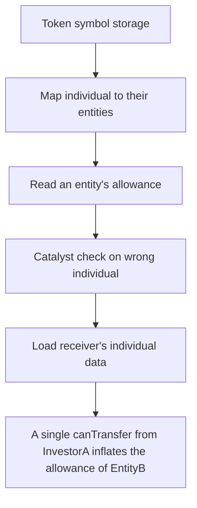

# Remora: A single canTransfer from InvestorA inflates the allowance of EntityB and EntityD (entitie

> **Vulnerability classes:** vuln/locked-funds · vuln/unfair-mint
>
> **Reproduction:** a faithful minimal reproduction of the vulnerable finding — the vulnerable function is reproduced **verbatim** (marked `@>`) with faithful minimal doubles; local deploy, no fork.

<!-- source-auditvault: https://github.com/Auditware/AuditVault/blob/main/findings/63781-updating-the-entity-allowance-when-the-individual-belongs-to.md -->

## Root cause

A single canTransfer from InvestorA inflates the allowance of EntityB and EntityD (entities InvestorA is not part of) by 2000 units each because co-group member InvestorB is their catalyst, corrupting 5/50-rule accounting; on the receiver path an under-allowanced unrelated entity makes a legitimate transfer return false (DoS).

```solidity
            uint256 len = groups[gId].individuals.length;
            for (uint256 i; i < len; ++i) {
                address ind = groups[gId].individuals[i];
                if (individualData[ind].numCatalyst != 0) // @> enters for ANY group member that is a catalyst, even when it is not `from`, so `from`'s transfer mutates unrelated entities
                    _updateEntityAllowance(true, ind, amount);
            }
```

## Why it's exploitable here

A single canTransfer from InvestorA inflates the allowance of EntityB and EntityD (entities InvestorA is not part of) by 2000 units each because co-group member InvestorB is their catalyst, corrupting 5/50-rule accounting; on the receiver path an under-allowanced unrelated entity makes a legitimate transfer return false (DoS).

## Attack path



## Marked-line walkthrough (Playground)

The EVM Playground pins each step to the exact executed source line in `0x8ea53755a6…`:

1. **L40** — Token symbol storage: Setup: token metadata field on the security-token contract that enforces the 5/50 ownership rule.
2. **L83** — Map individual to their entities: Setup: `findEntity` links each individual to the entities they belong to, used to roll holdings up into entity allowances.
3. **L103** — Read an entity's allowance: Setup: returns an entity's current allowance under the 5/50 rule — the value the buggy update path corrupts.
4. **L119** — Catalyst check on wrong individual: Root cause: keying the update on a co-group member's `numCatalyst` inflates allowances of entities (EntityB, EntityD) the transferring investor never belonged to.
5. **L127** — Load receiver's individual data: On the receiver path, loads the recipient individual's data; the same catalyst mis-keying here under-allowances an unrelated entity.
6. **L146** — Read investor's catalyst count: Reads `numCatalyst` for an investor in the group — the field that decides, incorrectly, which entities get their allowance adjusted.
7. **L166** — canTransfer returns allowed: Returns true when checks pass, but the mis-keyed accounting can leave an unrelated entity under-allowanced so a legitimate transfer returns false (DoS).

## PoC

Registry (Foundry, local deploy — verbatim vulnerable source + harm-asserting test + negative control):

```bash
cd 63781-updating-the-entity-allowance-when-the-individual-belongs-to_exp
forge test -vvv
```

The browser Playground replays the same synthetic opcode-for-opcode and measures the harm: **A single canTransfer from InvestorA inflates the allowance of EntityB and EntityD (entities InvestorA is not part of) by 2000 units each bec**. Both gates are green (registry `forge test` PASS + Playground `_verify-poc` **VERDICT: PASS**).
