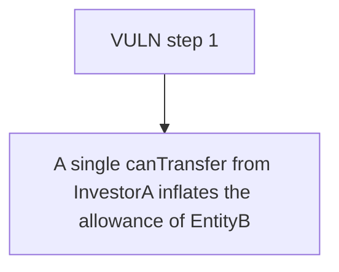

# Remora: A single canTransfer from InvestorA inflates the allowance of EntityB and EntityD (entitie

> **Vulnerability classes:** vuln/locked-funds · vuln/unfair-mint
>
> **Reproduction:** a faithful minimal reproduction of the vulnerable finding — the vulnerable function is reproduced **verbatim** (marked `@>`) with faithful minimal doubles; local deploy, no fork.

<!-- source-auditvault: https://github.com/Auditware/AuditVault/blob/main/findings/63781-updating-the-entity-allowance-when-the-individual-belongs-to.md -->

## Root cause

A single canTransfer from InvestorA inflates the allowance of EntityB and EntityD (entities InvestorA is not part of) by 2000 units each because co-group member InvestorB is their catalyst, corrupting 5/50-rule accounting; on the receiver path an under-allowanced unrelated entity makes a legitimate transfer return false (DoS).

```solidity
            uint256 len = groups[gId].individuals.length;
            for (uint256 i; i < len; ++i) {
                address ind = groups[gId].individuals[i];
                if (individualData[ind].numCatalyst != 0) // @> enters for ANY group member that is a catalyst, even when it is not `from`, so `from`'s transfer mutates unrelated entities
                    _updateEntityAllowance(true, ind, amount);
            }
```

## Why it's exploitable here

A single canTransfer from InvestorA inflates the allowance of EntityB and EntityD (entities InvestorA is not part of) by 2000 units each because co-group member InvestorB is their catalyst, corrupting 5/50-rule accounting; on the receiver path an under-allowanced unrelated entity makes a legitimate transfer return false (DoS).

## Attack path



## Marked-line walkthrough (Playground)

The EVM Playground pins each step to the exact executed source line in `0x8ea53755a6…`:

1. **L119** — VULN step 1: enters for ANY group member that is a catalyst, even when it is not `from`, so `from`'s transfer mutates unrelated entities

## PoC

Registry (Foundry, local deploy — verbatim vulnerable source + harm-asserting test + negative control):

```bash
cd 63781-updating-the-entity-allowance-when-the-individual-belongs-to_exp
forge test -vvv
```

The browser Playground replays the same synthetic opcode-for-opcode and measures the harm: **A single canTransfer from InvestorA inflates the allowance of EntityB and EntityD (entities InvestorA is not part of) by 2000 units each bec**. Both gates are green (registry `forge test` PASS + Playground `_verify-poc` **VERDICT: PASS**).
