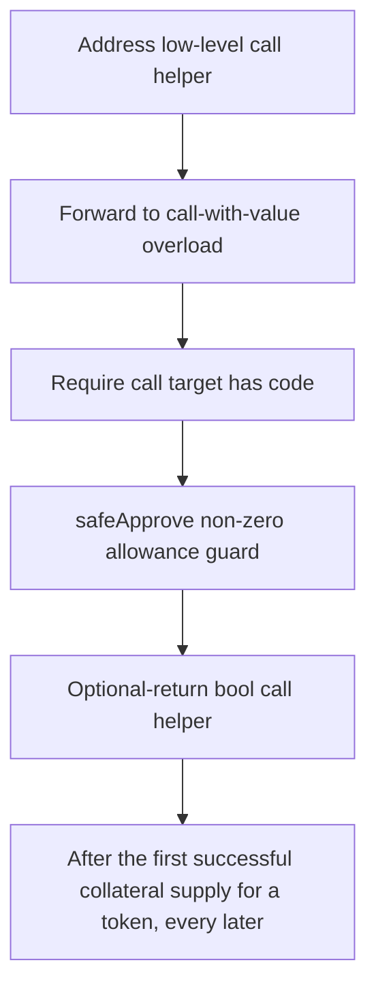

# Hyperlend: After the first successful collateral supply for a token

> **Vulnerability classes:** vuln/theft · vuln/locked-funds · vuln/reward-accounting
>
> **Reproduction:** a faithful minimal reproduction of the vulnerable finding — the vulnerable function is reproduced **verbatim** (marked `@>`) with faithful minimal doubles; local deploy, no fork.

<!-- source-auditvault: https://github.com/Auditware/AuditVault/blob/main/findings/63922-h-01-deprecated-safeapprove-usage-blocks-collateral-approval.md -->

## Root cause

After the first successful collateral supply for a token, every later executeOperation() for that token reverts inside the deprecated SafeERC20.safeApprove (non-zero-to-non-zero allowance), permanently bricking collateral supply through this path (liveness DoS; 100e18 collateral un-suppliable per call, no funds stolen).

```solidity
    }
}

// ─────────────────────────────────────────────────────────────────────────────
// FIXED contract: identical loop but with forceApprove() (the report's fix),
// which resets a non-zero allowance instead of reverting on it.
```

## Why it's exploitable here

After the first successful collateral supply for a token, every later executeOperation() for that token reverts inside the deprecated SafeERC20.safeApprove (non-zero-to-non-zero allowance), permanently bricking collateral supply through this path (liveness DoS; 100e18 collateral un-suppliable per call, no funds stolen).

## Attack path



## Marked-line walkthrough (Playground)

The EVM Playground pins each step to the exact executed source line in `0xce01759b82…`:

1. **L92** — Address low-level call helper: Setup: OpenZeppelin `Address.functionCallWithValue`, the low-level call primitive that SafeERC20 uses to send the approve.
2. **L93** — Forward to call-with-value overload: Setup: the 3-arg overload forwards to the full helper with a default revert string; plumbing behind `safeApprove`.
3. **L143** — Require call target has code: Setup: `Address` reverts unless the approve target is a contract before making the low-level call.
4. **L197** — safeApprove non-zero allowance guard: The deprecated `safeApprove` requires the new value be 0 or the current allowance be 0 — a non-zero-to-non-zero approve reverts here.
5. **L250** — Optional-return bool call helper: Setup: SafeERC20 helper that calls a token and tolerates non-standard ERC20s that return no bool.
6. **L366** — Fixed collateral executor contract: Setup: the patched executor that resets or uses `forceApprove` instead of the `safeApprove` that bricks re-supply.
7. **L372** — Store lending pool address: Setup: constructor wires the lending `pool` this executor supplies collateral into.

## PoC

Registry (Foundry, local deploy — verbatim vulnerable source + harm-asserting test + negative control):

```bash
cd 63922-h-01-deprecated-safeapprove-usage-blocks-collateral-approval_exp
forge test -vvv
```

The browser Playground replays the same synthetic opcode-for-opcode and measures the harm: **After the first successful collateral supply for a token, every later executeOperation() for that token reverts inside the deprecated SafeER**. Both gates are green (registry `forge test` PASS + Playground `_verify-poc` **VERDICT: PASS**).
