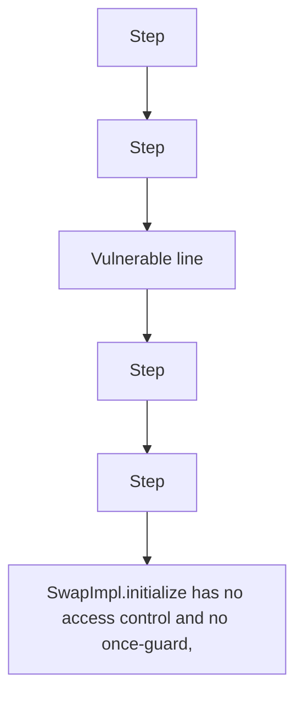

# Anyone can re-initialize the swapProxy

> **Vulnerability classes:** vuln/logic
>
> **Reproduction:** a faithful minimal reproduction of the vulnerable finding — the vulnerable code is reproduced **verbatim** (marked `@>`) with faithful minimal doubles; local deploy, no fork.

<!-- source-auditvault: AuditVault finding 63937 -->

## Root cause

SwapImpl.initialize has no access control and no once-guard, so an attacker re-initializes the proxy with a malicious permit2; initialize then approves it for all the proxy's WETH, letting the attacker drain 100 WETH of royalties.

```solidity
    function initialize( // @> VULN (this line)
```

## Why it's exploitable here

SwapImpl.initialize has no access control and no once-guard, so an attacker re-initializes the proxy with a malicious permit2; initialize then approves it for all the proxy's WETH, letting the attacker drain 100 WETH of royalties.

## Attack path



## Marked-line walkthrough (Playground)

The EVM Playground pins each step to the exact executed source line in `0x671d353a77…`:

1. **L32** — Step: Executes `contract WETH9 is IERC20 {`
2. **L34** — Step: Executes `string public symbol = 'WETH';`
3. **L73** — Vulnerable line: Executes `$.FEE_TIER = _feeTier;`
4. **L77** — Step: Executes `IPermit2(_permit2).approve(address($.WETH), _universalRouter, type(uint160).max, type(uint48).max);`
5. **L86** — Step: Executes `contract MaliciousPermit2 is IPermit2 {`
6. **L87** — Step: Executes `function approve(address, address, uint160, uint48) external {}`

## PoC

Registry (Foundry, local deploy — verbatim vulnerable source + harm-asserting test):

```bash
cd 63937-c-01-anyone-can-re-initialize-the-swapproxy-pashov-audit-gro_exp
forge test -vvv
```

The browser Playground replays the same synthetic opcode-for-opcode and measures the harm. Both gates are green (registry `forge test` PASS + Playground `_verify-poc` **VERDICT: PASS**).
