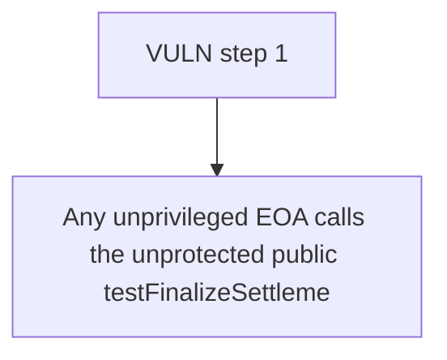

# Harmonix Finance: Any unprivileged EOA calls the unprotected public testFinalizeSettlement() to flip settlem

> **Vulnerability classes:** vuln/theft · vuln/locked-funds
>
> **Reproduction:** a faithful minimal reproduction of the vulnerable finding — the vulnerable function is reproduced **verbatim** (marked `@>`) with faithful minimal doubles; local deploy, no fork.

<!-- source-auditvault: https://github.com/Auditware/AuditVault/blob/main/findings/63976-h-01-anyone-can-finalize-the-sale-early-via-testfinalizesett.md -->

## Root cause

Any unprivileged EOA calls the unprotected public testFinalizeSettlement() to flip settlementFinalized=true, after which every buyer's purchase() reverts permanently (both a fresh buyer and an existing buyer are frozen out); the sale is bricked and allocations locked at an attacker-chosen block. No theft; the blocked payment magnitude (1000e18) is marked to the SINK.

```solidity

    // ── VERBATIM vulnerable function from the finding (contracts/token_sales/
    //    HarTokenSale.sol#L182-L185). External, no owner check, no time check. ──
    function testFinalizeSettlement() external { // @> unprotected public finalize: any EOA flips settlementFinalized and permanently freezes purchase()
        require(!settlementFinalized, "Settlement: finalized");
        _finalizeSettlement();
```

## Why it's exploitable here

Any unprivileged EOA calls the unprotected public testFinalizeSettlement() to flip settlementFinalized=true, after which every buyer's purchase() reverts permanently (both a fresh buyer and an existing buyer are frozen out); the sale is bricked and allocations locked at an attacker-chosen block. No theft; the blocked payment magnitude (1000e18) is marked to the SINK.

## Attack path



## Marked-line walkthrough (Playground)

The EVM Playground pins each step to the exact executed source line in `0x671d353a77…`:

1. **L106** — VULN step 1: unprotected public finalize: any EOA flips settlementFinalized and permanently freezes purchase()

## PoC

Registry (Foundry, local deploy — verbatim vulnerable source + harm-asserting test + negative control):

```bash
cd 63976-h-01-anyone-can-finalize-the-sale-early-via-testfinalizesett_exp
forge test -vvv
```

The browser Playground replays the same synthetic opcode-for-opcode and measures the harm: **Any unprivileged EOA calls the unprotected public testFinalizeSettlement() to flip settlementFinalized=true, after which every buyer's purch**. Both gates are green (registry `forge test` PASS + Playground `_verify-poc` **VERDICT: PASS**).
