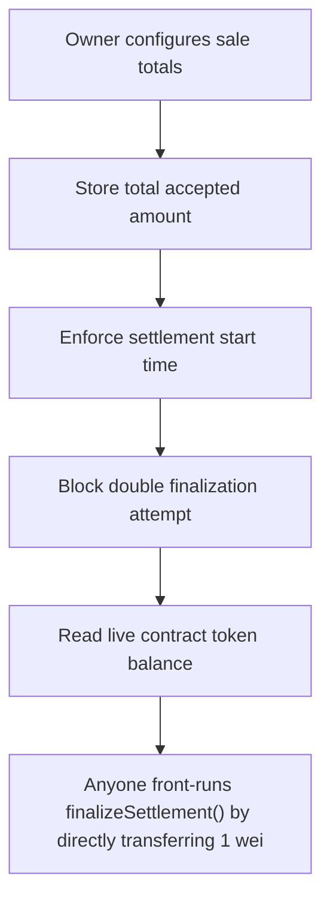

# Harmonix Finance: Anyone front-runs finalizeSettlement() by directly transferring 1 wei of purchaseToken to 

> **Vulnerability classes:** vuln/locked-funds
>
> **Reproduction:** a faithful minimal reproduction of the vulnerable finding — the vulnerable function is reproduced **verbatim** (marked `@>`) with faithful minimal doubles; local deploy, no fork.

<!-- source-auditvault: https://github.com/Auditware/AuditVault/blob/main/findings/63977-h-02-the-finalizesettlement-can-be-dossed-leading-to-refund.md -->

## Root cause

Anyone front-runs finalizeSettlement() by directly transferring 1 wei of purchaseToken to the sale; the strict equality on the live balance never holds again, so settlement can never finalize and the entire ~600,000 purchaseToken refund pool (gated on finalization) is permanently frozen in the contract.

```solidity
        uint256 curBalance = purchaseToken.balanceOf(address(this));
        uint256 safetyBuffer = 1000;
        uint256 totalRefund = totalCommitted - totalAccepted;
        require(curBalance + safetyBuffer == totalRefund, "Settlement: total refund not matched"); // @> strict equality on the LIVE token balance: any unsolicited dust transfer to the contract makes curBalance != totalRefund - safetyBuffer, so settlement reverts forever
    }
    // ============================================================================
```

## Why it's exploitable here

Anyone front-runs finalizeSettlement() by directly transferring 1 wei of purchaseToken to the sale; the strict equality on the live balance never holds again, so settlement can never finalize and the entire ~600,000 purchaseToken refund pool (gated on finalization) is permanently frozen in the contract.

## Attack path



## Marked-line walkthrough (Playground)

The EVM Playground pins each step to the exact executed source line in `0x671d353a77…`:

1. **L105** — Owner configures sale totals: Setup: owner sets committed and accepted totals used to derive the expected refund pool.
2. **L107** — Store total accepted amount: Setup: records the accepted total that feeds the refund-matching equation checked at finalization.
3. **L121** — Enforce settlement start time: `finalizeSettlement` may only run after `settleTime`, giving an attacker a known window to front-run it.
4. **L122** — Block double finalization attempt: Guards against finalizing twice; moot once the balance check below can never pass again.
5. **L125** — Read live contract token balance: Reads the contract's live `purchaseToken` balance — an externally manipulable value, since anyone can transfer tokens in.
6. **L128** — Strict equality on live balance: Root-cause bug: strict `==` on the live balance means a 1-wei donation makes it never equal `totalRefund`, freezing finalization forever.
7. **L133** — Refund path gated on finalization: The refund claim depends on settlement finalizing; with finalize permanently DoSed, the whole refund pool stays locked.

## PoC

Registry (Foundry, local deploy — verbatim vulnerable source + harm-asserting test + negative control):

```bash
cd 63977-h-02-the-finalizesettlement-can-be-dossed-leading-to-refund_exp
forge test -vvv
```

The browser Playground replays the same synthetic opcode-for-opcode and measures the harm: **Anyone front-runs finalizeSettlement() by directly transferring 1 wei of purchaseToken to the sale; the strict equality on the live balance **. Both gates are green (registry `forge test` PASS + Playground `_verify-poc` **VERDICT: PASS**).
