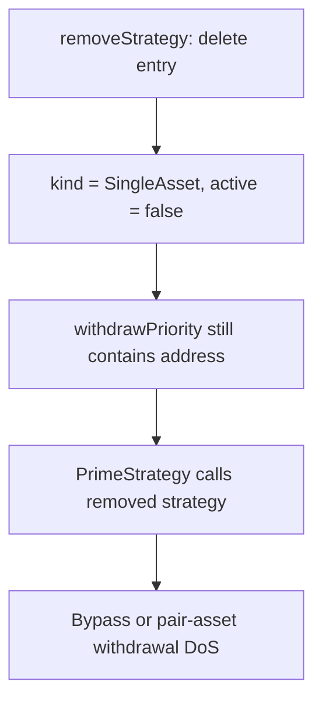

# Prime Vaults — removed strategy remains callable during withdrawal

> **Vulnerability classes:** vuln/logic/incorrect-state-transition · vuln/dos/frozen-funds
>
> **Reproduction:** local synthetic Foundry reduction; the complete passing trace is in [output.txt](output.txt).

<!-- non-defihacklabs -->
<!-- source-auditvault: https://github.com/Auditware/AuditVault/blob/main/findings/64014-h-01-removed-strategy-can-bypass-removal-and-block-withdrawa.md -->
<!-- date: 2025-01 -->

## Key info

| Field | Value |
|---|---|
| Loss | A strategy deleted from the registry still withdraws 100 units; a pair strategy would instead freeze the loop. |
| Vulnerable contract | `PrimeStrategy.withdraw` in [test/64014-h-01-removed-strategy-bypass-removal-block-withdrawals.sol](test/64014-h-01-removed-strategy-bypass-removal-block-withdrawals.sol) |
| Attacker EOA | `0x1111111111111111111111111111111111111111` |
| Attack contract | `Exploit` |
| Attack tx | Local Foundry `Exploit.run()` |
| Chain · block · date | Ethereum model · block 0 · synthetic |
| Compiler | Solidity `^0.8.24` |
| Bug class | Removed registry entry defaults to active-kind path |

## TL;DR

`removeStrategy` deletes a struct, resetting `kind` to `SingleAsset` and `active` to false. `PrimeStrategy` ignores `active`, so its withdrawal queue still calls the removed strategy (or reverts for pair assets).

## Background

Strategy removal is an administrative safety control. Withdrawal priority must skip inactive entries and continue to the next live strategy.

## The vulnerable code

```solidity
(StrategyKind kind,) = registry.strategies(priority);
// @> VULN: active is ignored after delete resets kind to zero.
if (kind == StrategyKind.SingleAsset) {
    withdrawn = SingleAssetStrategy(priority).withdraw(shortfall);
}
```

## Root cause

The registry's deletion semantics and consumer's enum-only dispatch disagree. A deleted entry is interpreted as `SingleAsset` and remains reachable from the priority queue.

## Preconditions

- A strategy is present in withdrawal priority.
- The owner removes it with `delete`.
- The vault performs no `active` check before external withdrawal.

## Attack walkthrough

1. Register a single-asset strategy with 100 units and queue it.
2. Delete the registry entry.
3. Call `withdraw(100)`; the removed address is still called and returns 100. Trace assertion: [output.txt:4](output.txt#L4).

## Diagrams



## Remediation

Read and enforce `active`; return zero for inactive entries and continue the queue. Wrap untrusted strategy calls in `try/catch` so one removed/reverting strategy cannot freeze all withdrawals.

## How to reproduce

```bash
cd evm-hack-registry/64014-h-01-removed-strategy-bypass-removal-block-withdrawals_exp
forge test -vvvvv
```

## Sources

- [AuditVault finding #64014](https://github.com/Auditware/AuditVault/blob/main/findings/64014-h-01-removed-strategy-can-bypass-removal-and-block-withdrawa.md)
- [Shieldify Prime Vaults review](https://github.com/shieldify-security/audits-portfolio-md/blob/main/Prime-Vaults-Security-Review.md)
- [Synthetic test](test/64014-h-01-removed-strategy-bypass-removal-block-withdrawals.sol)

*Reference: https://github.com/shieldify-security/audits-portfolio-md/blob/main/Prime-Vaults-Security-Review.md*
