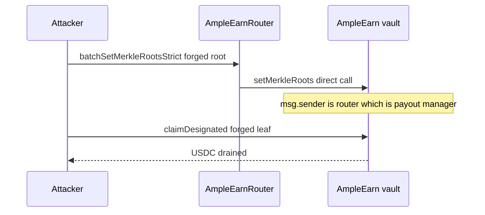

# AmpleEarn — unrestricted router allows unauthorized merkle root setting

> **Reproduction:** self-contained Foundry PoC (forge-std only) — no fork.
> Full trace: [output.txt](output.txt).

<!-- non-defihacklabs -->
<!-- source-auditvault: https://github.com/Auditware/AuditVault/blob/main/findings/64041-c-01-unrestricted-router-allows-unauthorized-merkle-root-set.md -->
<!-- date: 2025-12 -->

**AuditVault taxonomy:** lang/solidity · platform/pashov · severity/high · genome: missing-modifier · direct-drain · account-ownership

---

## Key info

| | |
|---|---|
| **Impact** | **HIGH** — 100 USDC payout pot stolen by forging designated-recipient merkle roots via an unrestricted router that is registered as payout manager |
| **Protocol** | AmpleEarn |
| **Bug class** | Router batchSetMerkleRootsStrict has no auth; vault setMerkleRoots authorizes msg.sender, which is the router when not routed through EVC |
| **Finding** | Pashov Audit Group (C-01) · #64041 |
| **Report** | https://github.com/pashov/audits/blob/master/team/md/AmpleEarn-security-review_2025-12-12.md |
| **Source** | [AuditVault](https://github.com/Auditware/AuditVault/blob/main/findings/64041-c-01-unrestricted-router-allows-unauthorized-merkle-root-set.md) |
| **Status** | Audit finding — reproduced as a standalone local synthetic |
| **Compiler** | `^0.8.24` (PoC) |

---

## TL;DR

Router batchSetMerkleRootsStrict has no auth; vault setMerkleRoots authorizes msg.sender, which is the router when not routed through EVC

**HARM:** 100 USDC payout pot stolen by forging designated-recipient merkle roots via an unrestricted router that is registered as payout manager

---

## Root cause

Router batchSetMerkleRootsStrict has no auth; vault setMerkleRoots authorizes msg.sender, which is the router when not routed through EVC

## Preconditions

Protocol-specific setup as described in the original finding (roles / managers / pending state in place).

## Attack walkthrough

See the synthetic `test/64041-c-01-unrestricted-router-allows-unauthorized-merkle-root-set.sol` and the Playground story beats. The `@> VULN` marker sits on the blamed executable line.

## Diagrams

## Impact

100 USDC payout pot stolen by forging designated-recipient merkle roots via an unrestricted router that is registered as payout manager

## Sources

- [AuditVault finding](https://github.com/Auditware/AuditVault/blob/main/findings/64041-c-01-unrestricted-router-allows-unauthorized-merkle-root-set.md)
- Report: https://github.com/pashov/audits/blob/master/team/md/AmpleEarn-security-review_2025-12-12.md
- Reduced source provenance: AmpleEarnRouter.batchSetMerkleRootsStrict (audited client sources as quoted in report)
