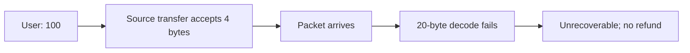

# Toki Bridge — malformed recipient bytes silently burn tokens

> **Vulnerability classes:** vuln/input-validation/wrong-type · vuln/bridge/missing-validation · vuln/dos/frozen-funds
>
> **Reproduction:** local synthetic Foundry reduction; the complete passing trace is in [output.txt](output.txt).

<!-- non-defihacklabs -->
<!-- source-auditvault: https://github.com/Auditware/AuditVault/blob/main/findings/64067-h-01-recipient-bytes-silent-burn-when-non-20-byte-payloads-p.md -->
<!-- date: 2025-01 -->

## Key info

| Field | Value |
|---|---|
| Loss | A four-byte recipient burns 100 source units and credits no destination account. |
| Vulnerable contract | `TokiBridge.transfer` / `onRecv` in [test/64067-h-01-recipient-bytes-silent-burn-non-20-byte.sol](test/64067-h-01-recipient-bytes-silent-burn-non-20-byte.sol) |
| Attacker EOA | `0x1111111111111111111111111111111111111111` |
| Attack contract | `Exploit` |
| Attack tx | Local Foundry `Exploit.run()` |
| Chain · block · date | Ethereum model · block 0 · synthetic |
| Compiler | Solidity `^0.8.24` |
| Bug class | Recipient payload type/length validation failure |

## TL;DR

The bridge accepts any non-empty recipient bytes, but the destination decoder accepts only 20-byte EVM addresses. Decode failure enters an unrecoverable branch without a retry/refund payload.

## Background

Bridge source accounting is debited before an IBC packet is delivered. Inputs that the destination cannot decode must be rejected at source or persisted for a recoverable refund.

## The vulnerable code

```solidity
function transfer(bytes calldata to, uint256 amount) external {
    require(to.length > 0 && to.length <= 1024, "recipient length");
    // @> VULN: arbitrary non-empty bytes are debited as if an address.
    sourceBalance[msg.sender] -= amount;
}
```

## Root cause

`_validateToLength` checks only broad bounds while destination `decodeAddress` requires exactly 20 bytes. The failure path emits no recoverable transfer payload.

## Preconditions

- A user submits a recipient payload of a length other than 20 bytes.
- Source accounting is burned/escrowed before destination decoding.
- Destination failure handling does not persist a refund.

## Attack walkthrough

1. Seed the source account with 100 units and transfer to `0xdeadbeef`.
2. Destination `onRecv` returns false for the four-byte payload.
3. Both balances are zero, proving silent loss at [output.txt:4](output.txt#L4).

## Diagrams



## Remediation

Require `to.length == 20` for EVM destinations (or decode to `address` at source). If arbitrary payloads are supported, persist a complete retry/refund message on failure.

## How to reproduce

```bash
cd evm-hack-registry/64067-h-01-recipient-bytes-silent-burn-non-20-byte_exp
forge test -vvvvv
```

## Sources

- [AuditVault finding #64067](https://github.com/Auditware/AuditVault/blob/main/findings/64067-h-01-recipient-bytes-silent-burn-when-non-20-byte-payloads-p.md)
- [Shieldify Toki Bridge review](https://github.com/shieldify-security/audits-portfolio-md/blob/main/Toki-Bridge-Security-Review.md)
- [Synthetic test](test/64067-h-01-recipient-bytes-silent-burn-non-20-byte.sol)

*Reference: https://github.com/shieldify-security/audits-portfolio-md/blob/main/Toki-Bridge-Security-Review.md*
