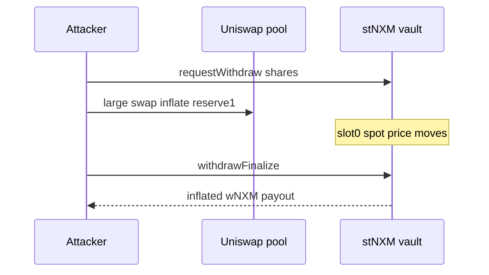

# stNXM — attacker profits by manipulating Uniswap liquidity via slot0

> **Reproduction:** self-contained Foundry PoC (forge-std only) — no fork.
> Full trace: [output.txt](output.txt).

<!-- non-defihacklabs -->
<!-- source-auditvault: https://github.com/Auditware/AuditVault/blob/main/findings/64079-h-1-attacker-can-profit-by-manipulating-uniswap-liquidity-sh.md -->
<!-- date: 2025-11 -->

**AuditVault taxonomy:** lang/solidity · platform/sherlock · severity/high · vuln/oracle/spot-price · trigger/flash-loan · genome: spot-price · price-manipulation

---

## Key info

| | |
|---|---|
| **Impact** | **HIGH** — Inflated ERC4626 withdrawal paid from free liquidity after same-tx Uniswap slot0 manipulation; residual stakers lose value |
| **Protocol** | stNXM by EaseDeFi |
| **Bug class** | dexBalances reads Uniswap V3 slot0 spot price to value LP inside totalAssets |
| **Finding** | Sherlock 0xpetern et al. (H-1) · #64079 |
| **Report** | https://github.com/sherlock-audit/2025-11-stnxm-by-easedefi-judging |
| **Source** | [AuditVault](https://github.com/Auditware/AuditVault/blob/main/findings/64079-h-1-attacker-can-profit-by-manipulating-uniswap-liquidity-sh.md) |
| **Status** | Audit finding — reproduced as a standalone local synthetic |
| **Compiler** | `^0.8.24` (PoC) |

---

## TL;DR

dexBalances reads Uniswap V3 slot0 spot price to value LP inside totalAssets

**HARM:** Inflated ERC4626 withdrawal paid from free liquidity after same-tx Uniswap slot0 manipulation; residual stakers lose value

---

## Root cause

dexBalances reads Uniswap V3 slot0 spot price to value LP inside totalAssets

## Preconditions

Protocol-specific setup as described in the original finding (roles / managers / pending state in place).

## Attack walkthrough

See the synthetic `test/64079-h-1-attacker-can-profit-by-manipulating-uniswap-liquidity-sh.sol` and the Playground story beats. The `@> VULN` marker sits on the blamed executable line.

## Diagrams

## Impact

Inflated ERC4626 withdrawal paid from free liquidity after same-tx Uniswap slot0 manipulation; residual stakers lose value

## Sources

- [AuditVault finding](https://github.com/Auditware/AuditVault/blob/main/findings/64079-h-1-attacker-can-profit-by-manipulating-uniswap-liquidity-sh.md)
- Report: https://github.com/sherlock-audit/2025-11-stnxm-by-easedefi-judging
- Reduced source provenance: github.com/sherlock-audit/2025-11-stnxm-by-easedefi stNXM.sol dexBalances
