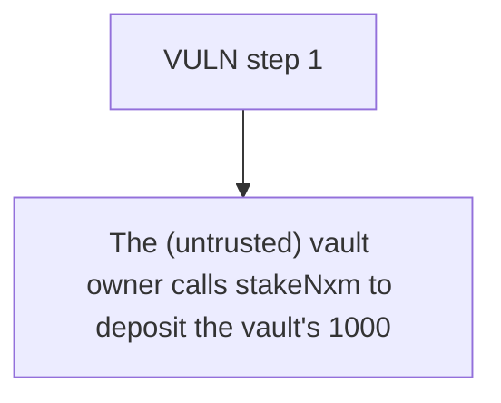

# stETH: The (untrusted) vault owner calls stakeNxm to deposit the vault's 1000 NXM into a Nexus st

> **Vulnerability classes:** vuln/theft
>
> **Reproduction:** a faithful minimal reproduction of the vulnerable finding — the vulnerable function is reproduced **verbatim** (marked `@>`) with faithful minimal doubles; local deploy, no fork.

<!-- source-auditvault: https://github.com/Auditware/AuditVault/blob/main/findings/64080-h-2-the-vault-can-be-drained-sherlock-steth-by-easedefi-git.md -->

## Root cause

The (untrusted) vault owner calls stakeNxm to deposit the vault's 1000 NXM into a Nexus staking NFT the owner keeps, then withdraws the stake — draining the vault: vault wNXM/NXM go to 0 and the attacker EOA gains 1000 NXM.

```solidity
        nxm.approve(nxmMaster.getLatestAddress("TC"), _amount);

        IStakingPool pool = IStakingPool(_poolAddress);
        uint256 tokenId = pool.depositTo(_amount, _trancheId, _requestTokenId, address(this)); // @> no `require(stakingNFT.ownerOf(tokenId)==address(this))`: stake is credited to the attacker-owned requestTokenId, draining the vault

        // if new nft token is minted we need to keep track of
```

## Why it's exploitable here

The (untrusted) vault owner calls stakeNxm to deposit the vault's 1000 NXM into a Nexus staking NFT the owner keeps, then withdraws the stake — draining the vault: vault wNXM/NXM go to 0 and the attacker EOA gains 1000 NXM.

## Attack path



## Marked-line walkthrough (Playground)

The EVM Playground pins each step to the exact executed source line in `0xaf38a9c57e…`:

1. **L322** — VULN step 1: no `require(stakingNFT.ownerOf(tokenId)==address(this))`: stake is credited to the attacker-owned requestTokenId, draining the vault

## PoC

Registry (Foundry, local deploy — verbatim vulnerable source + harm-asserting test + negative control):

```bash
cd 64080-h-2-the-vault-can-be-drained-sherlock-steth-by-easedefi-git_exp
forge test -vvv
```

The browser Playground replays the same synthetic opcode-for-opcode and measures the harm: **The (untrusted) vault owner calls stakeNxm to deposit the vault's 1000 NXM into a Nexus staking NFT the owner keeps, then withdraws the stak**. Both gates are green (registry `forge test` PASS + Playground `_verify-poc` **VERDICT: PASS**).
