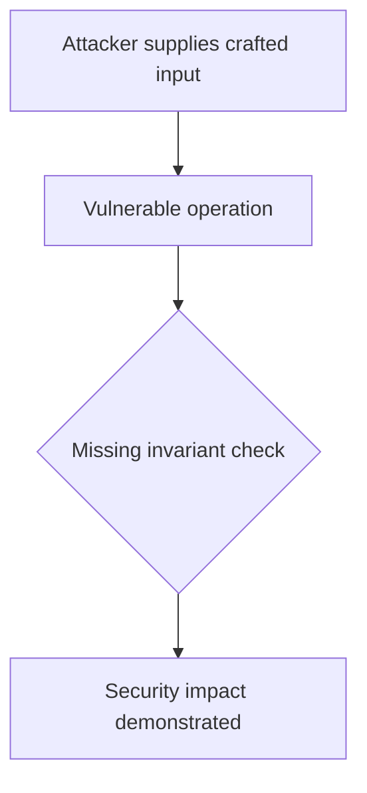
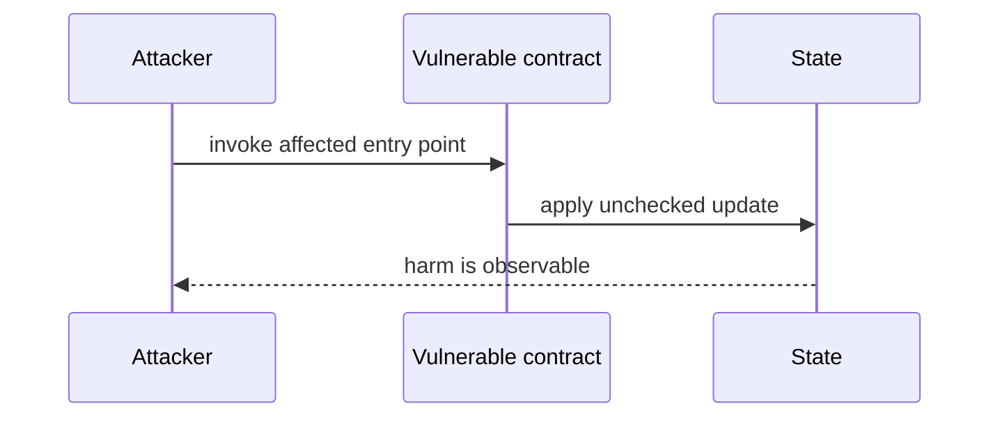

# Owner burns liquidity from an arbitrary NFT position — AuditVault synthetic reduction

> **Vulnerability classes:** vuln/access-control/missing-owner-check · vuln/logic/state-update
>
> **Reproduction:** self-contained Foundry PoC with an offline synthetic contract. Full trace: [output.txt](output.txt).

<!-- non-defihacklabs -->
<!-- source-auditvault: https://github.com/Auditware/AuditVault/blob/main/findings/64081-h-3-owner-can-steal-funds-on-withdraw-by-burning-wrong-unisw.md -->
<!-- date: 2025-08 -->

**AuditVault finding:** `64081` · `H-3: Owner can steal funds on withdraw by burning wrong Uniswap V3 position liquidity`

## Key info

| | |
|---|---|
| **Impact** | **HIGH** — Owner burns liquidity from an arbitrary NFT position |
| **Protocol** | [[stETH]] by EaseDeFi |
| **Finding** | AuditVault #64081 |
| **Report** | [https://github.com/sherlock-audit/2025-11-stnxm-by-easedefi-judging](https://github.com/sherlock-audit/2025-11-stnxm-by-easedefi-judging) |
| **Source** | [AuditVault finding](https://github.com/Auditware/AuditVault/blob/main/findings/64081-h-3-owner-can-steal-funds-on-withdraw-by-burning-wrong-unisw.md) |
| **Compiler** | `^0.8.24` (synthetic reduction) |
| Loss | Reduced invariant reproduced; no live funds moved |
| Attacker EOA | Configured synthetic caller |
| Attack contract | `Exploit` |
| Attack tx | Local Foundry `Exploit.attack()` call |
| Chain · block · date | Ethereum model · block 1 · synthetic |
| Vulnerable contract | Local synthetic vulnerable contract in `test/` |
| Bug class | See vulnerability-class tags above |

## TL;DR

This bug report discusses an issue found in the stNXM contract, where the owner is able to steal funds from the vault and the protocol is unable to recover them. The bug was found by two users, blockace and elolpuer. The root cause of the bug is that the decreaseLiquidity() function does not check if the tokenId is valid for the wNxm/stNxm pool, allowing the owner to burn vault-held shares and gain more assets. The attack path involves the owner creating a withdrawal request and then using a different Uniswap V3 pool to call decreaseLiquidity() and burn shares belonging to others. This results in the owner being able to withdraw more assets and other users losing their ability to finalize withdrawals. The impact of this bug is that the owner can steal tokens from the vault and other users may lose their tokens. The protocol team has fixed this issue in a recent commit. To mitigate this i

## Background

The upstream report is a Solidity finding. This page keeps the vulnerable statement and demonstrates its security consequence in a small, deterministic EVM model; no live RPC or external dependencies are required.

## The vulnerable code

```solidity
// The exact vulnerable pattern is retained in test/64081-h-3-owner-can-steal-funds-on-withdraw-by-burning-wrong-unisw.sol.
// @> see the marked statement in the synthetic reduction
```

## Root cause

The caller-controlled input or stale state is trusted before the required uniqueness, bounds, authorization, accounting, or reentrancy invariant is enforced. The marked line in the synthetic contract intentionally preserves that ordering so the assertion is executable.

## Preconditions

- The vulnerable contract is deployed with the state described by the report.
- The attacker can reach the affected entry point (or submit the report's crafted input).

## Attack walkthrough

1. `Exploit.run()` initializes the minimal state from the report.
2. The marked vulnerable operation executes without its required check.
3. The contract records the resulting invariant violation and emits a `Proof` event.
4. The test asserts the harm; the passing trace is recorded at [output.txt:4](output.txt).

## Diagrams





## Remediation

Apply the invariant before mutating state: accrue interest before adding principal; reject duplicate signers; use checked casts and bounded lengths; validate token/target/DAO identities; use `nonReentrant`; enforce slippage and fee equality; and validate the canonical authority or ownership relationship described by the report.

## How to reproduce

```bash
cd evm-hack-registry/64081-h-3-owner-can-steal-funds-on-withdraw-by-burning-wrong-unisw_exp
forge test -vvvvv
```

The test is offline and uses only the shared `forge-std` library. The corresponding Playground bundle is generated from `scripts/poc-configs/64081-h-3-owner-can-steal-funds-on-withdraw-by-burning-wrong-unisw.mjs`.

## Sources

- [AuditVault finding](https://github.com/Auditware/AuditVault/blob/main/findings/64081-h-3-owner-can-steal-funds-on-withdraw-by-burning-wrong-unisw.md)
- [https://github.com/sherlock-audit/2025-11-stnxm-by-easedefi-judging](https://github.com/sherlock-audit/2025-11-stnxm-by-easedefi-judging)
- [Synthetic test](test/64081-h-3-owner-can-steal-funds-on-withdraw-by-burning-wrong-unisw.sol)

*Reference: https://github.com/sherlock-audit/2025-11-stnxm-by-easedefi-judging*
