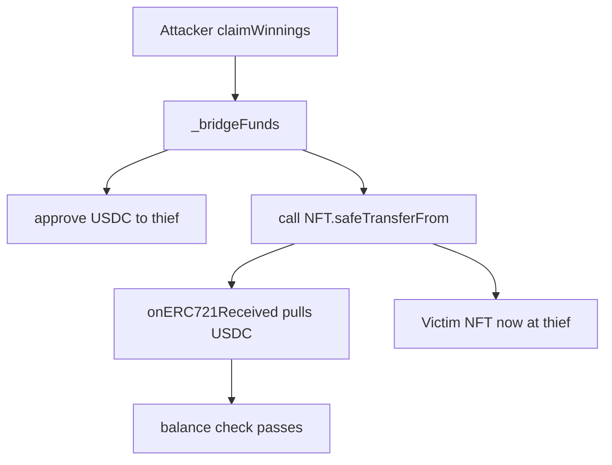

# Megapot — Attacker can steal JackpotTicketNFTs from JackpotBridgeManager

> **Reproduction:** self-contained Foundry PoC (forge-std only) — no fork.
> Full trace: [output.txt](output.txt).

<!-- non-defihacklabs -->
<!-- source-auditvault: https://github.com/Auditware/AuditVault/blob/main/findings/64140-h-01-attacker-can-steal-jackpotticketnfts-from-jackpotbridge.md -->
<!-- date: 2025-11 -->

**AuditVault taxonomy:** lang/solidity · platform/code4rena · severity/high · sector/bridge · sector/nft · genome: broken-logic · direct-drain · account-ownership

---

## Key info

| | |
|---|---|
| **Impact** | **HIGH** — attacker steals custody JackpotTicketNFTs (and drains approved USDC via callback) |
| **Protocol** | Megapot |
| **Bug class** | User-controlled external call in `_bridgeFunds` after USDC approve |
| **Finding** | Code4rena 2025-11-megapot H-01 · #64140 |
| **Report** | https://code4rena.com/reports/2025-11-megapot |
| **Source** | [AuditVault](https://github.com/Auditware/AuditVault/blob/main/findings/64140-h-01-attacker-can-steal-jackpotticketnfts-from-jackpotbridge.md) |
| **Status** | Audit finding — reproduced as a standalone local synthetic |
| **Compiler** | `^0.8.24` (PoC) |

---

## TL;DR

`_bridgeFunds` calls `_bridgeDetails.to` with attacker-supplied calldata after optionally approving USDC. Pointing `to` at the ticket NFT and `data` at `safeTransferFrom(bridge → thief, victimId)` steals custody NFTs; `onERC721Received` pulls the approved USDC so the balance check passes.

**HARM:** victim's ticket NFT moves to the attacker contract; bridge USDC for the claim is drained in the callback.

---

## Root cause

User-controlled low-level call in `_bridgeFunds` with no whitelist / RelayTxData validation.

## Preconditions

Bridge holds victim ticket NFTs in custody; attacker has claimable winnings.

## Attack walkthrough

See synthetic `test/64140-….sol`. Story beats: seed custody → malicious `claimWinnings` → `_bridgeFunds` external call → NFT stolen.

## Diagrams

## Impact

Custody NFTs representing cross-chain tickets/winnings can be stolen by any claimer who supplies a malicious `RelayTxData`.

## Sources

- [AuditVault finding](https://github.com/Auditware/AuditVault/blob/main/findings/64140-h-01-attacker-can-steal-jackpotticketnfts-from-jackpotbridge.md)
- Report: https://code4rena.com/reports/2025-11-megapot
- Reduced source provenance: github.com/code-423n4/2025-11-megapot@f0a7297 JackpotBridgeManager.sol
