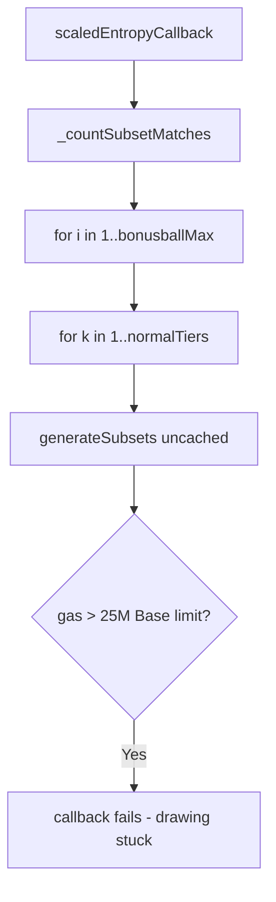

# Megapot — Unoptimized subset matches counting exceeds Base tx gas limit

> **Reproduction:** self-contained Foundry PoC (forge-std only) — no fork.
> Full trace: [output.txt](output.txt).

<!-- non-defihacklabs -->
<!-- source-auditvault: https://github.com/Auditware/AuditVault/blob/main/findings/64141-h-02-unoptimized-subset-matches-counting-implementation-will.md -->
<!-- date: 2025-11 -->

**AuditVault taxonomy:** lang/solidity · platform/code4rena · severity/high · sector/gaming · genome: gas-limit · permanent

---

## Key info

| | |
|---|---|
| **Impact** | **HIGH** — entropy callback exceeds Base 25M tx gas → drawing never settles |
| **Protocol** | Megapot |
| **Bug class** | Uncached `generateSubsets` inside `bonusballMax × normalTiers` nested loops |
| **Finding** | Code4rena 2025-11-megapot H-02 · #64141 |
| **Report** | https://code4rena.com/reports/2025-11-megapot |
| **Source** | [AuditVault](https://github.com/Auditware/AuditVault/blob/main/findings/64141-h-02-unoptimized-subset-matches-counting-implementation-will.md) |
| **Status** | Audit finding — sample+extrapolate gas PoC |
| **Compiler** | `^0.8.24` (PoC) |

---

## TL;DR

`_countSubsetMatches` regenerates subsets for every bonusball. At `bonusballMax=129` the settlement callback measures ~25.8M gas and exceeds Base's 25M per-tx limit, so Pyth cannot settle the drawing.

**HARM:** extrapolated settlement gas at real `bonusballMax` exceeds Base tx gas limit → permanent drawing DoS.

---

## Root cause

Uncached combinatorial subset generation inside nested settlement loops.

## Preconditions

Large pool → high `bonusballMax` (e.g. 129 at 16M USDC cap).

## Attack walkthrough

Sample gas at small `bonusballMax`, extrapolate linearly to 129, require `> 25_000_000`.

## Diagrams

## Impact

Drawings at high `bonusballMax` cannot be settled; jackpot liveness fails.

## Sources

- [AuditVault finding](https://github.com/Auditware/AuditVault/blob/main/findings/64141-h-02-unoptimized-subset-matches-counting-implementation-will.md)
- Report: https://code4rena.com/reports/2025-11-megapot
- Reduced source provenance: github.com/code-423n4/2025-11-megapot@f0a7297 TicketComboTracker.sol
