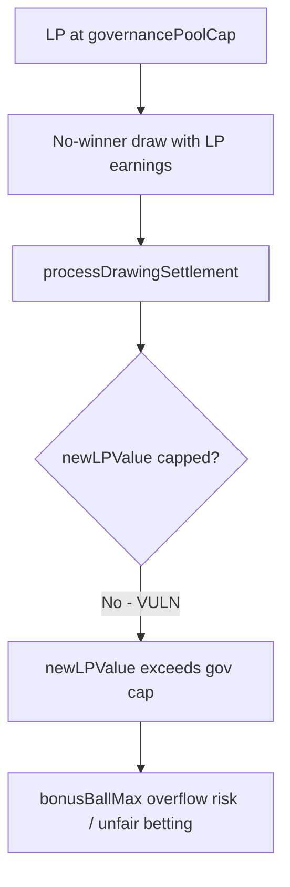

# Megapot — LP pool cap may be exceeded on drawing settlement

> **Reproduction:** self-contained Foundry PoC (forge-std only) — no fork.
> Full trace: [output.txt](output.txt).

<!-- non-defihacklabs -->
<!-- source-auditvault: https://github.com/Auditware/AuditVault/blob/main/findings/64142-h-03-lp-pool-cap-may-be-exceeded-on-drawing-settlement-code4.md -->
<!-- date: 2025-11 -->

**AuditVault taxonomy:** lang/solidity · platform/code4rena · severity/high · sector/prediction · genome: frozen-funds · wrong-state · integer-bounds

---

## Key info

| | |
|---|---|
| **Impact** | **HIGH** — newLPValue exceeds governancePoolCap after a no-winner draw, breaking Pool Cap Compliance and enabling later ticket bit-vector overflow DoS |
| **Protocol** | Megapot |
| **Bug class** | processDrawingSettlement computes newLPValue without the same pool-cap clamp used on deposits |
| **Finding** | Code4rena h2134 (H-03) · #64142 |
| **Report** | https://code4rena.com/reports/2025-11-megapot |
| **Source** | [AuditVault](https://github.com/Auditware/AuditVault/blob/main/findings/64142-h-03-lp-pool-cap-may-be-exceeded-on-drawing-settlement-code4.md) |
| **Status** | Audit finding — reproduced as a standalone local synthetic |
| **Compiler** | `^0.8.24` (PoC) |

---

## TL;DR

processDrawingSettlement computes newLPValue without the same pool-cap clamp used on deposits

**HARM:** newLPValue exceeds governancePoolCap after a no-winner draw, breaking Pool Cap Compliance and enabling later ticket bit-vector overflow DoS

---

## Root cause

processDrawingSettlement computes newLPValue without the same pool-cap clamp used on deposits

## Preconditions

Protocol-specific setup as described in the original finding (roles / managers / pending state in place).

## Attack walkthrough

See the synthetic `test/64142-h-03-lp-pool-cap-may-be-exceeded-on-drawing-settlement-code4.sol` and the Playground story beats. The `@> VULN` marker sits on the blamed executable line.

## Diagrams

## Impact

newLPValue exceeds governancePoolCap after a no-winner draw, breaking Pool Cap Compliance and enabling later ticket bit-vector overflow DoS

## Sources

- [AuditVault finding](https://github.com/Auditware/AuditVault/blob/main/findings/64142-h-03-lp-pool-cap-may-be-exceeded-on-drawing-settlement-code4.md)
- Report: https://code4rena.com/reports/2025-11-megapot
- Reduced source provenance: github.com/code-423n4/2025-11-megapot@f0a7297 JackpotLPManager.sol
