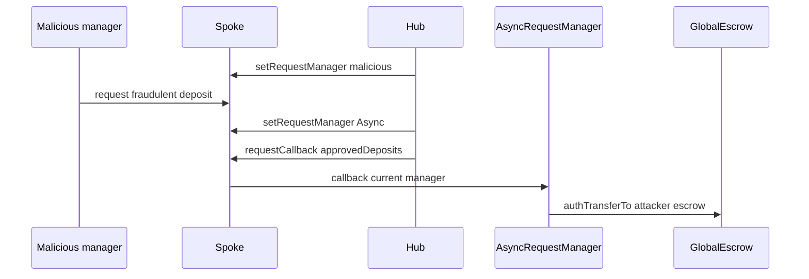

# Centrifuge v3.1 — pool managers steal other pools pending deposits

> **Reproduction:** self-contained Foundry PoC (forge-std only) — no fork.
> Full trace: [output.txt](output.txt).

<!-- non-defihacklabs -->
<!-- source-auditvault: https://github.com/Auditware/AuditVault/blob/main/findings/64195-h-1-pool-managers-can-steal-all-other-pools-pending-deposits.md -->
<!-- date: 2025-10 -->

**AuditVault taxonomy:** lang/solidity · platform/sherlock · severity/high · genome: centralization · direct-drain · bridge-sender-auth

---

## Key info

| | |
|---|---|
| **Impact** | **HIGH** — All pending deposits in globalEscrow transferable to attacker pool escrow via requestManager swap |
| **Protocol** | Centrifuge Protocol v3.1 |
| **Bug class** | Spoke.requestCallback uses current requestManager without binding to the manager that created the request |
| **Finding** | Sherlock 0x52 et al. (H-1) · #64195 |
| **Report** | https://github.com/sherlock-audit/2025-10-centrifuge-protocol-v3-1-audit-judging |
| **Source** | [AuditVault](https://github.com/Auditware/AuditVault/blob/main/findings/64195-h-1-pool-managers-can-steal-all-other-pools-pending-deposits.md) |
| **Status** | Audit finding — reproduced as a standalone local synthetic |
| **Compiler** | `^0.8.24` (PoC) |

---

## TL;DR

Spoke.requestCallback uses current requestManager without binding to the manager that created the request

**HARM:** All pending deposits in globalEscrow transferable to attacker pool escrow via requestManager swap

---

## Root cause

Spoke.requestCallback uses current requestManager without binding to the manager that created the request

## Preconditions

Protocol-specific setup as described in the original finding (roles / managers / pending state in place).

## Attack walkthrough

See the synthetic `test/64195-h-1-pool-managers-can-steal-all-other-pools-pending-deposits.sol` and the Playground story beats. The `@> VULN` marker sits on the blamed executable line.

## Diagrams

## Impact

All pending deposits in globalEscrow transferable to attacker pool escrow via requestManager swap

## Sources

- [AuditVault finding](https://github.com/Auditware/AuditVault/blob/main/findings/64195-h-1-pool-managers-can-steal-all-other-pools-pending-deposits.md)
- Report: https://github.com/sherlock-audit/2025-10-centrifuge-protocol-v3-1-audit-judging
- Reduced source provenance: github.com/sherlock-audit/2025-10-centrifuge-protocol-v3-1-audit Spoke.sol requestCallback
