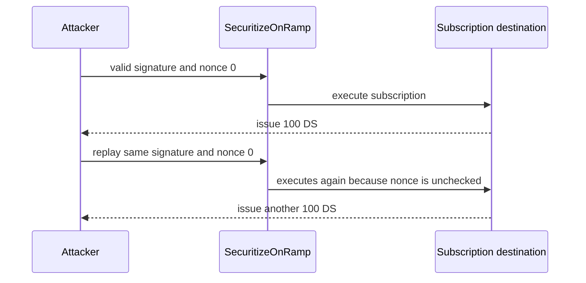

# Securitize OnRamp replay — signed transactions remain valid after use

<!-- non-defihacklabs -->
<!-- source-auditvault: https://github.com/Auditware/AuditVault/blob/main/findings/64270-missing-nonce-validation-in-signature-verification-allows-tr.md -->
<!-- date: 2025-07 -->

> **Vulnerability classes:** vuln/bridge/replay · vuln/auth/signature-validation · vuln/logic/missing-validation

> **Reproduction:** Local synthetic, runnable offline with `forge test -vvv` in [the PoC folder](.). The browser replay calls `Exploit.run()` and verifies duplicate DS issuance.

## Key info

| Field | Value |
|---|---|
| Loss | 200 synthetic DS tokens issued after replaying one 100-USDC authorization |
| Vulnerable contract | `SecuritizeOnRamp` |
| Attacker | Any party able to resubmit a previously valid pre-approved transaction |
| Chain | Local EVM synthetic (audit finding; no historical fork) |
| Compiler | Solidity 0.8.24 |
| Bug class | Missing nonce validation / signature replay |

## TL;DR

`executePreApprovedTransaction` includes a nonce in the signed payload, but only increments the stored nonce. It never requires the supplied nonce to equal the current expected nonce. A once-valid nonce-zero subscription can therefore be submitted twice, executing the destination call twice and issuing duplicate investor tokens.

## The vulnerable code

The reduction preserves the material line from `SecuritizeOnRamp.sol`:

```solidity
// FIX: require(txData.nonce == noncePerInvestor[txData.senderInvestor], "invalid nonce");
noncePerInvestor[txData.senderInvestor] = noncePerInvestor[txData.senderInvestor] + 1; // @> VULN: stored nonce is incremented but txData.nonce is never validated, so an old valid signature replays.
(bool ok,) = txData.destination.call(txData.data);
```

## Root cause

Authenticity and freshness are separate properties. Signature recovery proves an authorization was produced by a permitted signer; it does not prove that the authorization has not already been consumed. Incrementing `noncePerInvestor` after recovery does not invalidate an old payload unless `txData.nonce` is compared to that stored value first.

## Preconditions

- A valid signed subscription payload exists.
- The investor still has the assets/allowance required by the destination on replay.
- The attacker can submit the valid payload again.

## Attack walkthrough

1. `Exploit.run()` funds its synthetic investor with 200 USDC and prepares one nonce-zero subscription.
2. The first call transfers 100 USDC and issues 100 DS tokens.
3. The on-ramp increments its stored nonce but accepts no equality check.
4. The exact same signature and `txData` execute again.
5. The invariant assertions show stored nonce `2`, 200 DS issued, and all 200 USDC consumed.

## Diagrams



## Impact

Every previously valid authorization can be replayed until the investor's available balance or allowance is exhausted. That can duplicate subscriptions, swaps, token issuance, and accounting effects.

## Remediation

Before signature recovery and the destination call, require `txData.nonce == noncePerInvestor[txData.senderInvestor]`; then increment it exactly once. Reject mismatched or stale nonces.

## How to reproduce

```bash
cd /workspaces/RustroverProjects/audits/evm-hack-registry/64270-missing-nonce-validation-in-signature-verification-allows-tr_exp
forge test -vvv
```

The browser bundle is generated from [`scripts/poc-configs/64270-missing-nonce-validation-in-signature-verification-allows-tr.mjs`](../../../../drafts/crypto-training/crypto-training/scripts/poc-configs/64270-missing-nonce-validation-in-signature-verification-allows-tr.mjs).

## Sources

- [AuditVault finding #64270](https://github.com/Auditware/AuditVault/blob/main/findings/64270-missing-nonce-validation-in-signature-verification-allows-tr.md)
- [Cyfrin Securitize On/Off Ramp report](https://github.com/solodit/solodit_content/blob/main/reports/Cyfrin/2025-07-23-cyfrin-securitize-onofframp-bridge-v2.1.md)
- [Securitize remediation commit `65179b`](https://github.com/securitize-io/bc-on-off-ramp-sc/commit/65179bcf41ed859106069dcaa751f5a2cec3038e)
