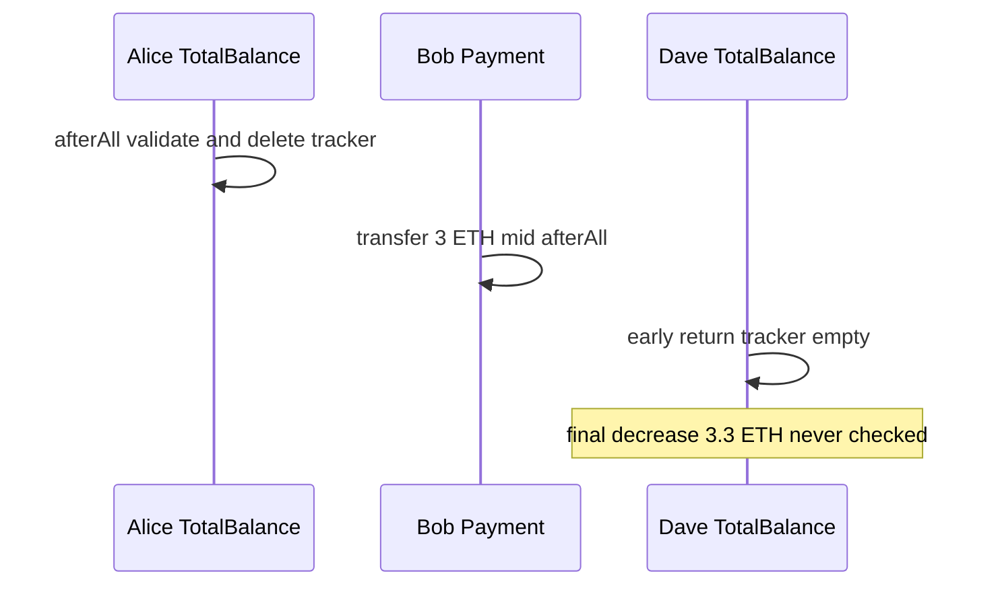

# MetaMask — TotalBalanceEnforcer validation bypass with state-modifying enforcers

> **Reproduction:** self-contained Foundry PoC (forge-std only) — no fork.
> Full trace: [output.txt](output.txt).

<!-- non-defihacklabs -->
<!-- source-auditvault: https://github.com/Auditware/AuditVault/blob/main/findings/64325-totalbalanceenforcer-validation-bypass-when-mixed-with-state.md -->
<!-- date: 2025-09 -->

**AuditVault taxonomy:** lang/solidity · platform/cyfrin · severity/high · sector/wallet · genome: missing-check · wrong-state · variant

---

## Key info

| | |
|---|---|
| **Impact** | **HIGH** — Max-decrease balance constraints silently bypassed; Alice loses 3.3 ETH including a 3 ETH payment that should have reverted |
| **Protocol** | MetaMask Delegation Framework |
| **Bug class** | afterAllHook early-returns when shared BalanceTracker was cleaned by a prior TotalBalance enforcer; later enforcers skip validation after mid-chain state changes |
| **Finding** | Cyfrin Chinmay Farkya · #64325 |
| **Report** | https://github.com/solodit/solodit_content/blob/main/reports/Cyfrin/2025-09-01-cyfrin-metamask-TotalBalanceEnforcer-v2.0.md |
| **Source** | [AuditVault](https://github.com/Auditware/AuditVault/blob/main/findings/64325-totalbalanceenforcer-validation-bypass-when-mixed-with-state.md) |
| **Status** | Audit finding — reproduced as a standalone local synthetic |
| **Compiler** | `^0.8.24` (PoC) |

---

## TL;DR

afterAllHook early-returns when shared BalanceTracker was cleaned by a prior TotalBalance enforcer; later enforcers skip validation after mid-chain state changes

**HARM:** Max-decrease balance constraints silently bypassed; Alice loses 3.3 ETH including a 3 ETH payment that should have reverted

---

## Root cause

afterAllHook early-returns when shared BalanceTracker was cleaned by a prior TotalBalance enforcer; later enforcers skip validation after mid-chain state changes

## Preconditions

Protocol-specific setup as described in the original finding (roles / managers / pending state in place).

## Attack walkthrough

See the synthetic `test/64325-totalbalanceenforcer-validation-bypass-when-mixed-with-state.sol` and the Playground story beats. The `@> VULN` marker sits on the blamed executable line.

## Diagrams

## Impact

Max-decrease balance constraints silently bypassed; Alice loses 3.3 ETH including a 3 ETH payment that should have reverted

## Sources

- [AuditVault finding](https://github.com/Auditware/AuditVault/blob/main/findings/64325-totalbalanceenforcer-validation-bypass-when-mixed-with-state.md)
- Report: https://github.com/solodit/solodit_content/blob/main/reports/Cyfrin/2025-09-01-cyfrin-metamask-TotalBalanceEnforcer-v2.0.md
- Reduced source provenance: MetaMask delegation framework NativeTokenTotalBalanceChangeEnforcer afterAllHook
