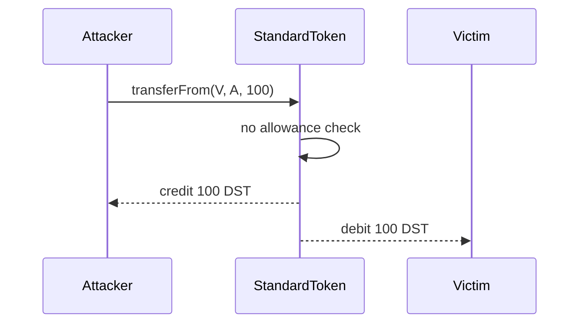

# Securitize DSToken — unapproved `transferFrom` theft

<!-- non-defihacklabs -->
<!-- source-auditvault: https://github.com/Auditware/AuditVault/blob/main/findings/64373-investors-can-steal-tokens-from-other-investors-since-standa.md -->
<!-- date: 2025-10 -->

> **Vulnerability classes:** vuln/logic/missing-check · vuln/access-control/broken-logic

> **Reproduction:** Local synthetic; `forge test -vvv` passes offline in [this folder](.).

## Key info

| Field | Value |
|---|---|
| Loss | 100 DST stolen from an investor with zero allowance |
| Vulnerable contract | `StandardToken` |
| Chain | Local EVM synthetic |
| Compiler | Solidity 0.8.24 |
| Bug class | Missing ERC20 spending-approval check |

## TL;DR

`StandardToken.transferFrom` calls its transfer primitive directly and never checks the owner's allowance for `msg.sender`. An arbitrary investor can therefore debit any other investor and transfer their DSToken balance to itself.

## The vulnerable code

```solidity
// FIX: allowance[_from][msg.sender] -= _value;
_transfer(_from, _to, _value); // @> VULN: transferFrom moves another investor's balance without checking spending approval.
```

## Root cause

The contract exposes the ERC20 `transferFrom` interface but omits the authorization invariant that distinguishes it from an unrestricted administrative transfer.

## Preconditions

- A victim has a positive DST balance.
- The attacker can call the token contract.

## Attack walkthrough

1. The reduction issues 500 DST to a victim account.
2. It proves the victim gave the attacker allowance `0`.
3. The attacker calls `transferFrom(victim, attacker, 100)`.
4. The unchecked transfer succeeds and the attacker receives 100 DST.

## Diagrams



## Impact

Any investor's entire token balance is directly stealable without a signature or allowance.

## Remediation

Require and decrement `allowance[_from][msg.sender]` before the transfer, while retaining the conventional infinite-allowance behavior if intended.

## How to reproduce

```bash
cd /workspaces/RustroverProjects/audits/evm-hack-registry/64373-investors-can-steal-tokens-from-other-investors-since-standa_exp
forge test -vvv
```

## Sources

- [AuditVault finding #64373](https://github.com/Auditware/AuditVault/blob/main/findings/64373-investors-can-steal-tokens-from-other-investors-since-standa.md)
- [Cyfrin DSToken report](https://github.com/solodit/solodit_content/blob/main/reports/Cyfrin/2025-10-10-cyfrin-securitize-dstoken-rebasing-v2.1.md)
- [Securitize remediation `aefb895`](https://github.com/securitize-io/dstoken/commit/aefb895e520d93ef0a8278ce3a7e88b2808478f5)
