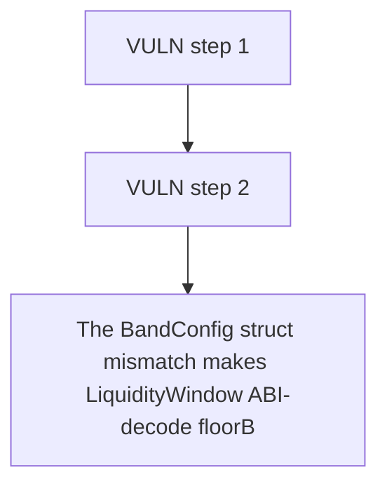

# Buck Labs: The BandConfig struct mismatch makes LiquidityWindow ABI-decode floorBps from PolicyManage

> **Vulnerability classes:** vuln/theft
>
> **Reproduction:** a faithful minimal reproduction of the vulnerable finding — the vulnerable function is reproduced **verbatim** (marked `@>`) with faithful minimal doubles; local deploy, no fork.

<!-- source-auditvault: https://github.com/Auditware/AuditVault/blob/main/findings/64664-abi-struct-mismatch-in-band-config-spearbit-none-buck-labs-s.md -->

## Root cause

The BandConfig struct mismatch makes LiquidityWindow ABI-decode floorBps from PolicyManager's deviationThresholdBps (25 bps) instead of the real floorBps (100 bps), so requestRefund lets a refunder over-drain 7,500 USDC (75 bps of supply) of reserves below the intended floor to the attacker EOA.

```solidity

    address public policyManager;
    MiniToken public reserveToken;
    uint256 public totalTokenSupply;
    uint256 public reserves;

```

## Why it's exploitable here

The BandConfig struct mismatch makes LiquidityWindow ABI-decode floorBps from PolicyManager's deviationThresholdBps (25 bps) instead of the real floorBps (100 bps), so requestRefund lets a refunder over-drain 7,500 USDC (75 bps of supply) of reserves below the intended floor to the attacker EOA.

## Attack path



## Marked-line walkthrough (Playground)

The EVM Playground pins each step to the exact executed source line in `0xce01759b82…`:

1. **L184** — VULN step 1: mismatched position: ABI-decodes PolicyManager word4 (deviationThresholdBps=25), not the real floorBps (100)
2. **L192** — VULN step 2: mismatched position: ABI-decodes PolicyManager word4 (deviationThresholdBps=25), not the real floorBps (100)

## PoC

Registry (Foundry, local deploy — verbatim vulnerable source + harm-asserting test + negative control):

```bash
cd 64664-abi-struct-mismatch-in-band-config-spearbit-none-buck-labs-s_exp
forge test -vvv
```

The browser Playground replays the same synthetic opcode-for-opcode and measures the harm: **The BandConfig struct mismatch makes LiquidityWindow ABI-decode floorBps from PolicyManager's deviationThresholdBps (25 bps) instead of the **. Both gates are green (registry `forge test` PASS + Playground `_verify-poc` **VERDICT: PASS**).
