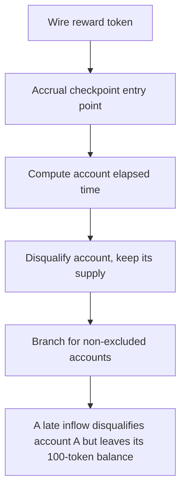

# Buck Labs: A late inflow disqualifies account A but leaves its 100-token balance in currentEligibleSu

> **Vulnerability classes:** vuln/locked-funds · vuln/reward-accounting
>
> **Reproduction:** a faithful minimal reproduction of the vulnerable finding — the vulnerable function is reproduced **verbatim** (marked `@>`) with faithful minimal doubles; local deploy, no fork.

<!-- source-auditvault: https://github.com/Auditware/AuditVault/blob/main/findings/64665-eligible-supply-is-not-reduced-on-late-entry-spearbit-none-b.md -->

## Root cause

A late inflow disqualifies account A but leaves its 100-token balance in currentEligibleSupply, inflating globalEligibleUnits (the distribution denominator); eligible account C is under-paid by 550,000 reward tokens and 600,000 reward tokens are permanently locked (undistributed) in the RewardsEngine.

```solidity
        // ─── verbatim vulnerable block (RewardsEngine.sol#L1257-L1274) ───
        bool isLateEntry = (checkpointStart > 0 && now_ >= checkpointStart && now_ < epochEnd);
        if (isLateEntry) {
            s.eligible = false; // @> late entry marks the account ineligible but its prior eligible balance is NEVER subtracted from currentEligibleSupply
            s.lastAccrualTime = now_;
        } else {
```

## Why it's exploitable here

A late inflow disqualifies account A but leaves its 100-token balance in currentEligibleSupply, inflating globalEligibleUnits (the distribution denominator); eligible account C is under-paid by 550,000 reward tokens and 600,000 reward tokens are permanently locked (undistributed) in the RewardsEngine.

## Attack path



## Marked-line walkthrough (Playground)

The EVM Playground pins each step to the exact executed source line in `0xce01759b82…`:

1. **L90** — Wire reward token: Setup: constructor stores the reward token the engine later distributes.
2. **L106** — Accrual checkpoint entry point: Permissionless checkpoint that updates per-account accrual and eligibility before distribution.
3. **L124** — Compute account elapsed time: Measures time since the account's last accrual to credit its pending reward units.
4. **L135** — Disqualify account, keep its supply: Root-cause bug: a late inflow flips the account ineligible but never subtracts its balance from `currentEligibleSupply`, inflating the reward denominator.
5. **L138** — Branch for non-excluded accounts: Only non-excluded accounts feed eligible supply — yet the balance just disqualified above is still being counted.
6. **L156** — Distribute over eligible units: Splits the reward across `globalEligibleUnits`; the inflated denominator underpays honest accounts and strands the rest.
7. **L171** — Update last accrual timestamp: Records the account's accrual time so the next checkpoint measures elapsed time from here.

## PoC

Registry (Foundry, local deploy — verbatim vulnerable source + harm-asserting test + negative control):

```bash
cd 64665-eligible-supply-is-not-reduced-on-late-entry-spearbit-none-b_exp
forge test -vvv
```

The browser Playground replays the same synthetic opcode-for-opcode and measures the harm: **A late inflow disqualifies account A but leaves its 100-token balance in currentEligibleSupply, inflating globalEligibleUnits (the distribut**. Both gates are green (registry `forge test` PASS + Playground `_verify-poc` **VERDICT: PASS**).
