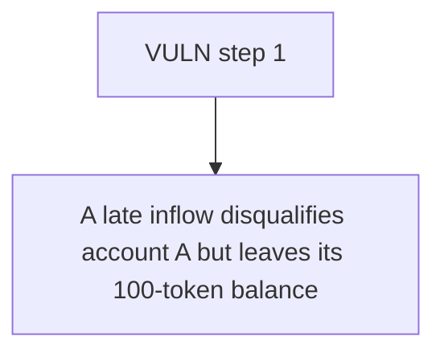

# Buck Labs: A late inflow disqualifies account A but leaves its 100-token balance in currentEligibleSu

> **Vulnerability classes:** vuln/locked-funds · vuln/reward-accounting
>
> **Reproduction:** a faithful minimal reproduction of the vulnerable finding — the vulnerable function is reproduced **verbatim** (marked `@>`) with faithful minimal doubles; local deploy, no fork.

<!-- source-auditvault: https://github.com/Auditware/AuditVault/blob/main/findings/64665-eligible-supply-is-not-reduced-on-late-entry-spearbit-none-b.md -->

## Root cause

A late inflow disqualifies account A but leaves its 100-token balance in currentEligibleSupply, inflating globalEligibleUnits (the distribution denominator); eligible account C is under-paid by 550,000 reward tokens and 600,000 reward tokens are permanently locked (undistributed) in the RewardsEngine.

```solidity
        // ─── verbatim vulnerable block (RewardsEngine.sol#L1257-L1274) ───
        bool isLateEntry = (checkpointStart > 0 && now_ >= checkpointStart && now_ < epochEnd);
        if (isLateEntry) {
            s.eligible = false; // @> late entry marks the account ineligible but its prior eligible balance is NEVER subtracted from currentEligibleSupply
            s.lastAccrualTime = now_;
        } else {
```

## Why it's exploitable here

A late inflow disqualifies account A but leaves its 100-token balance in currentEligibleSupply, inflating globalEligibleUnits (the distribution denominator); eligible account C is under-paid by 550,000 reward tokens and 600,000 reward tokens are permanently locked (undistributed) in the RewardsEngine.

## Attack path



## Marked-line walkthrough (Playground)

The EVM Playground pins each step to the exact executed source line in `0xce01759b82…`:

1. **L135** — VULN step 1: late entry marks the account ineligible but its prior eligible balance is NEVER subtracted from currentEligibleSupply

## PoC

Registry (Foundry, local deploy — verbatim vulnerable source + harm-asserting test + negative control):

```bash
cd 64665-eligible-supply-is-not-reduced-on-late-entry-spearbit-none-b_exp
forge test -vvv
```

The browser Playground replays the same synthetic opcode-for-opcode and measures the harm: **A late inflow disqualifies account A but leaves its 100-token balance in currentEligibleSupply, inflating globalEligibleUnits (the distribut**. Both gates are green (registry `forge test` PASS + Playground `_verify-poc` **VERDICT: PASS**).
