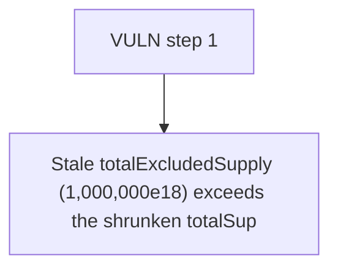

# Buck Labs: Stale totalExcludedSupply (1

> **Vulnerability classes:** vuln/locked-funds · vuln/reward-accounting
>
> **Reproduction:** a faithful minimal reproduction of the vulnerable finding — the vulnerable function is reproduced **verbatim** (marked `@>`) with faithful minimal doubles; local deploy, no fork.

<!-- source-auditvault: https://github.com/Auditware/AuditVault/blob/main/findings/64666-totalexcludedsupply-drifts-from-reality-spearbit-none-buck-l.md -->

## Root cause

Stale totalExcludedSupply (1,000,000e18) exceeds the shrunken totalSupply (100,000e18) after an excluded whale's tokens are burned through the hook, so configureEpoch()'s totalSupply()-totalExcludedSupply underflows and reverts permanently, freezing the 50,000e18 reward-USDC pool (rewards distribution can never be configured).

```solidity

    function _handleOutflow(address from, uint256 amount) internal {
        AccountState storage s = accounts[from];
        s.balance -= amount; // @> BUG: excluded-account outflow never decrements totalExcludedSupply -> drift, then underflow DoS
    }

```

## Why it's exploitable here

Stale totalExcludedSupply (1,000,000e18) exceeds the shrunken totalSupply (100,000e18) after an excluded whale's tokens are burned through the hook, so configureEpoch()'s totalSupply()-totalExcludedSupply underflows and reverts permanently, freezing the 50,000e18 reward-USDC pool (rewards distribution can never be configured).

## Attack path



## Marked-line walkthrough (Playground)

The EVM Playground pins each step to the exact executed source line in `0x671d353a77…`:

1. **L170** — VULN step 1: BUG: excluded-account outflow never decrements totalExcludedSupply -> drift, then underflow DoS

## PoC

Registry (Foundry, local deploy — verbatim vulnerable source + harm-asserting test + negative control):

```bash
cd 64666-totalexcludedsupply-drifts-from-reality-spearbit-none-buck-l_exp
forge test -vvv
```

The browser Playground replays the same synthetic opcode-for-opcode and measures the harm: **Stale totalExcludedSupply (1,000,000e18) exceeds the shrunken totalSupply (100,000e18) after an excluded whale's tokens are burned through t**. Both gates are green (registry `forge test` PASS + Playground `_verify-poc` **VERDICT: PASS**).
