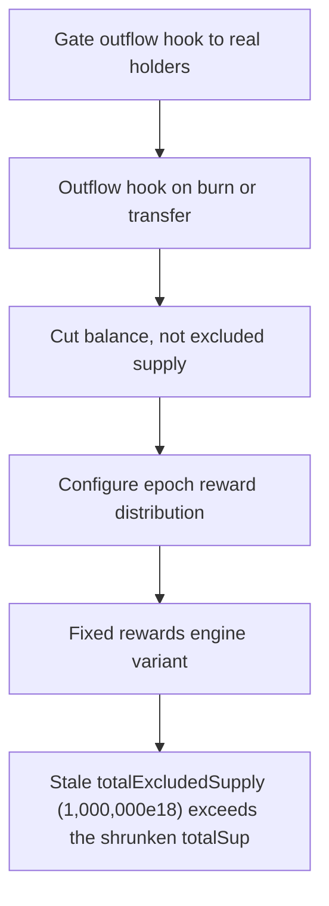

# Buck Labs: Stale totalExcludedSupply (1

> **Vulnerability classes:** vuln/locked-funds · vuln/reward-accounting
>
> **Reproduction:** a faithful minimal reproduction of the vulnerable finding — the vulnerable function is reproduced **verbatim** (marked `@>`) with faithful minimal doubles; local deploy, no fork.

<!-- source-auditvault: https://github.com/Auditware/AuditVault/blob/main/findings/64666-totalexcludedsupply-drifts-from-reality-spearbit-none-buck-l.md -->

## Root cause

Stale totalExcludedSupply (1,000,000e18) exceeds the shrunken totalSupply (100,000e18) after an excluded whale's tokens are burned through the hook, so configureEpoch()'s totalSupply()-totalExcludedSupply underflows and reverts permanently, freezing the 50,000e18 reward-USDC pool (rewards distribution can never be configured).

```solidity

    function _handleOutflow(address from, uint256 amount) internal {
        AccountState storage s = accounts[from];
        s.balance -= amount; // @> BUG: excluded-account outflow never decrements totalExcludedSupply -> drift, then underflow DoS
    }

```

## Why it's exploitable here

Stale totalExcludedSupply (1,000,000e18) exceeds the shrunken totalSupply (100,000e18) after an excluded whale's tokens are burned through the hook, so configureEpoch()'s totalSupply()-totalExcludedSupply underflows and reverts permanently, freezing the 50,000e18 reward-USDC pool (rewards distribution can never be configured).

## Attack path



## Marked-line walkthrough (Playground)

The EVM Playground pins each step to the exact executed source line in `0x671d353a77…`:

1. **L160** — Gate outflow hook to real holders: Setup: only runs the outflow bookkeeping for genuine holders, skipping mints (`from==0`) and the token's own transfers.
2. **L168** — Outflow hook on burn or transfer: The per-holder bookkeeping hook that fires whenever `from` sends or burns tokens, meant to keep the reward accounting in sync.
3. **L170** — Cut balance, not excluded supply: Reduces the excluded holder's balance on burn but never decrements `totalExcludedSupply`, leaving that aggregate stale above `totalSupply`.
4. **L179** — Configure epoch reward distribution: Later computes `totalSupply() - totalExcludedSupply`; once the stale excluded figure exceeds real supply this underflows and reverts forever.
5. **L190** — Fixed rewards engine variant: Setup: the corrected `RewardsEngineFixed` contract used for comparison, which keeps excluded supply in sync on outflow.
6. **L197** — Per-account state mapping: Setup: stores each account's balance and exclusion flag used by the reward bookkeeping.
7. **L202** — Token-only access modifier: Setup: restricts the outflow hook so only the token contract may invoke it.

## PoC

Registry (Foundry, local deploy — verbatim vulnerable source + harm-asserting test + negative control):

```bash
cd 64666-totalexcludedsupply-drifts-from-reality-spearbit-none-buck-l_exp
forge test -vvv
```

The browser Playground replays the same synthetic opcode-for-opcode and measures the harm: **Stale totalExcludedSupply (1,000,000e18) exceeds the shrunken totalSupply (100,000e18) after an excluded whale's tokens are burned through t**. Both gates are green (registry `forge test` PASS + Playground `_verify-poc` **VERDICT: PASS**).
