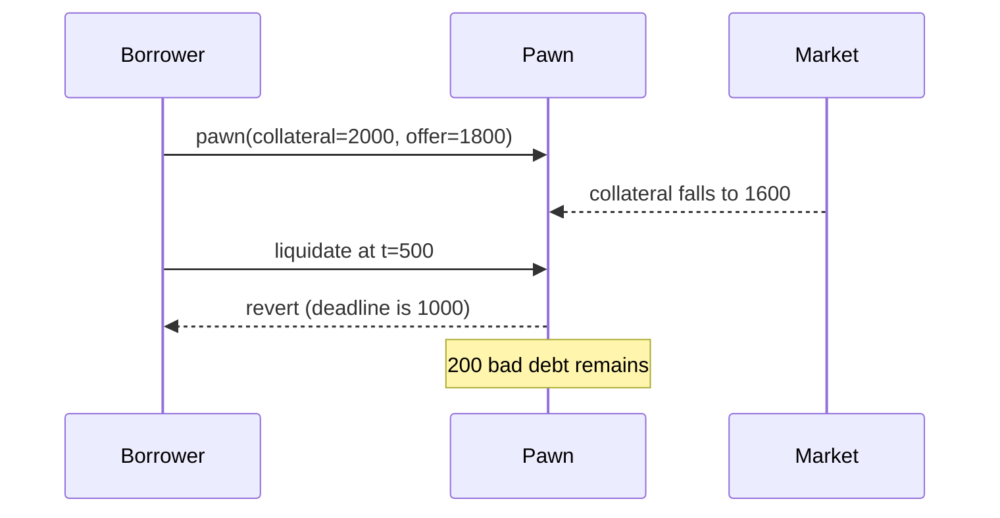

# Shiny Pawn — off-chain offer amount creates underwater loans

> **Vulnerability classes:** vuln/oracle/missing-validation · vuln/logic/liquidation-logic
>
> **Reproduction:** local synthetic Foundry reduction; the complete passing trace is in [output.txt](output.txt).

<!-- non-defihacklabs -->
<!-- source-auditvault: https://github.com/Auditware/AuditVault/blob/main/findings/64681-h-01-protocol-insolvency-risk-due-to-lack-of-on-chain-oracle.md -->
<!-- date: 2025-01 -->

## Key info

| Field | Value |
|---|---|
| Loss | A collateral fall leaves 200 units of modeled bad debt; no live funds are moved. |
| Vulnerable contract | `Pawn.pawn` / `Pawn.liquidate` in [test/64681-h-01-protocol-insolvency-risk-lack-on-chain-oracle.sol](test/64681-h-01-protocol-insolvency-risk-lack-on-chain-oracle.sol) |
| Attacker EOA | `0x1111111111111111111111111111111111111111` |
| Attack contract | `Exploit` |
| Attack tx | Local Foundry `Exploit.run()` |
| Chain · block · date | Ethereum model · block 0 · synthetic |
| Compiler | Solidity `^0.8.24` |
| Bug class | Missing on-chain LTV oracle and health-based liquidation |

## TL;DR

Pawn trusts a backend-signed `offerAmount` without checking collateral value on-chain, then permits liquidation only after a deadline. A price drop during the term creates bad debt that cannot be liquidated early.

## Background

RWA-backed lending needs an on-chain valuation or conservative LTV bound. A time-only liquidation condition cannot respond to an underwater position while the loan is still active.

## The vulnerable code

```solidity
function pawn(uint256 collateralValue, uint256 offerAmount, uint256 deadline) external returns (uint256 id) {
    // @> VULN: signed offer is accepted without on-chain LTV/oracle validation.
    id = nextId++;
    positions[id] = Position(offerAmount, collateralValue, deadline, true);
}
```

## Root cause

The protocol imports risk decisions from an off-chain signer and exposes no health-factor liquidation path. When collateral falls, borrower incentives and protocol recovery diverge.

## Preconditions

- A backend signs an offer near the maximum intended LTV.
- Collateral value drops before the loan deadline.
- `liquidate` checks only `now >= deadline`.

## Attack walkthrough

1. Originate 1,800 against a 2,000 appraisal with deadline 1,000.
2. Update modeled collateral to 1,600.
3. Liquidation at timestamp 500 reverts; `badDebt` is 200. See [output.txt:4](output.txt#L4).

## Diagrams



## Remediation

Validate `offerAmount <= collateralValue * maxLtv` against a trusted, fresh oracle at origination. Add health-factor liquidation during the term, normalize decimals, and define stale-feed behavior.

## How to reproduce

```bash
cd evm-hack-registry/64681-h-01-protocol-insolvency-risk-lack-on-chain-oracle_exp
forge test -vvvvv
```

## Sources

- [AuditVault finding #64681](https://github.com/Auditware/AuditVault/blob/main/findings/64681-h-01-protocol-insolvency-risk-due-to-lack-of-on-chain-oracle.md)
- [Shieldify Shiny review](https://github.com/shieldify-security/audits-portfolio-md/blob/main/Shiny-Security-Review.md)
- [Synthetic test](test/64681-h-01-protocol-insolvency-risk-lack-on-chain-oracle.sol)

*Reference: https://github.com/shieldify-security/audits-portfolio-md/blob/main/Shiny-Security-Review.md*
